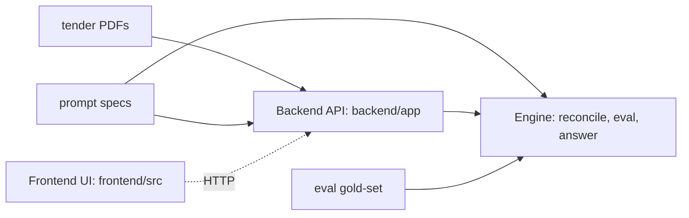
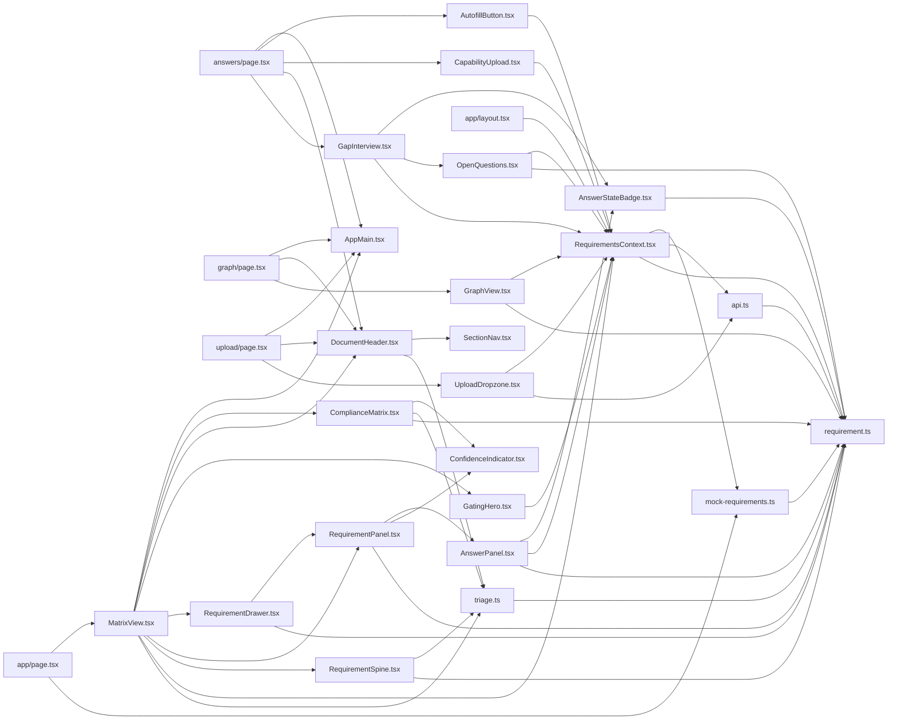
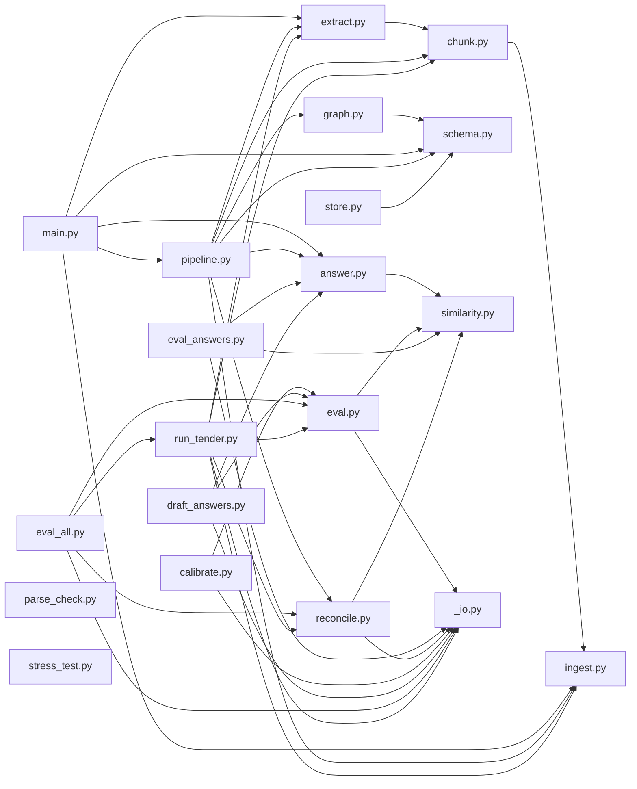

# CODEMAP — auto-generated map of this repository

> **Do not hand-edit.** Regenerated by `scripts/gen_codemap.py` on every push to `main` (`.github/workflows/codemap.yml`). To refresh locally: `python scripts/gen_codemap.py`.
>
> **Interactive graph:** [`frontend/public/codemap.html`](frontend/public/codemap.html) — drag / zoom / click-to-focus; served at `/codemap.html` on the Vercel deploy. (The diagrams below render right here on GitHub.)
>
> Map of commit `609a0fd` · 2026-06-29T21:03:13+01:00

**Read this first** for a current picture of the codebase — what lives where, and what imports what. It is the fast path to context for both humans and agents. If it looks wrong, it is stale: re-run the generator and push.

## Areas at a glance

| Area | Files | Lines | What it is |
|------|-------|-------|------------|
| **frontend** | 58 | 11,793 | Frontend — Next.js 16 / React 19 / Tailwind (compliance matrix UI) |
| **backend** | 17 | 1,907 | Backend — FastAPI (PDF ingest, extraction, REST API) |
| **engine** | 47 | 2,810 | Engine — reconcile / eval / answer-draft pipeline + tests |
| **prompts** | 6 | 678 | Prompts — LLM prompt specs (extraction, classification, answers, gaps) |
| **gold** | 4 | 219 | Eval gold-set — hand-labelled requirements for accuracy measurement |
| **data** | 17 | 0 | Data — tender source PDFs (not parsed here) |
| **comms** | 5 | 591 | Comms — async agent message boards |
| **docs** | 3 | 1,663 | Docs — plans & specs |
| **ci** | 1 | 62 | CI — GitHub Actions |
| **tooling** | 1 | 516 | Tooling — repo scripts (incl. this map generator) |
| **root** | 29 | 2,323 | Root — docs, config, role briefs |

## System shape

*Frontend ↔ Backend is an HTTP boundary (`frontend/src/lib/api.ts`), not an import — shown dashed. Everything else is a real code dependency.*

## Frontend module graph (`frontend/src`)

## Backend + Engine module graph (Python, tests excluded)

## Files by area

### frontend — Frontend — Next.js 16 / React 19 / Tailwind (compliance matrix UI)

- `frontend/.env.example`
- `frontend/.gitignore`
- `frontend/AGENTS.md`
- `frontend/CLAUDE.md`
- `frontend/DESIGN-SYSTEM.md`
- `frontend/README.md`
- `frontend/SLOP-CHECK.md`
- `frontend/copywriting.md`
- `frontend/design/colours.html`
- `frontend/design/type-specimen.html`
- `frontend/design/typography.html`
- `frontend/eslint.config.mjs`
- `frontend/layout.md`
- `frontend/next.config.ts`
- `frontend/package-lock.json`
- `frontend/package.json`
- `frontend/postcss.config.mjs`
- `frontend/public/codemap.html`
- `frontend/src/app/answers/page.tsx` — exports `metadata`
- `frontend/src/app/globals.css`
- `frontend/src/app/graph/page.tsx` — exports `metadata`
- `frontend/src/app/layout.tsx` — exports `metadata`
- `frontend/src/app/page.tsx` — exports `Home`
- `frontend/src/app/upload/page.tsx` — exports `metadata`
- `frontend/src/components/AnswerPanel.tsx` — exports `AnswerPanel`
- `frontend/src/components/AnswerStateBadge.tsx` — exports `AnswerStateBadge`
- `frontend/src/components/AppMain.tsx` — The shared page container (layout.md section 8): one centred column capped at
- `frontend/src/components/AutofillButton.tsx` — exports `AutofillButton`
- `frontend/src/components/CapabilityUpload.tsx` — exports `CapabilityUpload`
- `frontend/src/components/ComplianceMatrix.tsx` — exports `ComplianceMatrix`
- `frontend/src/components/ConfidenceIndicator.tsx` — The confidence dot (DESIGN-SYSTEM section 4, axis 1). Four tiers, worst to
- `frontend/src/components/DocumentHeader.tsx` — exports `DocumentHeader`
- `frontend/src/components/GapInterview.tsx` — exports `GapInterview`
- `frontend/src/components/GatingHero.tsx` — exports `GatingHero`
- `frontend/src/components/GraphView.tsx` — exports `GraphView`
- `frontend/src/components/MatrixView.tsx` — exports `MatrixView`
- `frontend/src/components/OpenQuestions.tsx` — exports `OpenQuestions`
- `frontend/src/components/RequirementDrawer.tsx` — exports `RequirementDrawer`
- `frontend/src/components/RequirementPanel.tsx` — exports `RequirementPanel`
- `frontend/src/components/RequirementSpine.tsx` — exports `RequirementSpine`
- `frontend/src/components/SectionNav.tsx` — exports `SectionNav`
- `frontend/src/components/UploadDropzone.tsx` — exports `UploadDropzone`
- `frontend/src/context/RequirementsContext.tsx` — exports `RequirementsProvider`
- `frontend/src/data/mock-requirements.ts` — exports `mockTender`
- `frontend/src/lib/api.ts` — exports `isApiEnabled`
- `frontend/src/lib/triage.ts` — exports `GroupKey`
- `frontend/src/types/requirement.ts` — exports `RequirementType`
- `frontend/tsconfig.json`
- `frontend/vercel.json`
- *(+9 binary/asset file(s))*

### backend — Backend — FastAPI (PDF ingest, extraction, REST API)

- `backend/.env.example`
- `backend/DEPLOY.md`
- `backend/Dockerfile`
- `backend/README.md`
- `backend/app/__init__.py` — Tender Breakdown backend package.
- `backend/app/chunk.py` — page-aware overlapping chunker.
- `backend/app/extract.py` — chunk → raw requirement objects.
- `backend/app/graph.py` — relationship edges (criteria_ref · depends_on).
- `backend/app/ingest.py` — PDF → page-numbered text.
- `backend/app/main.py` — Tender Breakdown API — FastAPI app.
- `backend/app/pipeline.py` — ingest → chunk → extract → assemble.
- `backend/app/schema.py` — the locked data contract as Pydantic models.
- `backend/app/store.py` — SQLite persistence (stdlib sqlite3, zero-config).
- `backend/requirements.txt`
- `backend/scripts/parse_check.py` — hour-one tender sanity check.
- `backend/scripts/stress_test.py` — throw real tenders at the full backend and log what breaks.
- `backend/scripts/tender-sources.txt`

### engine — Engine — reconcile / eval / answer-draft pipeline + tests

- `engine/.gitignore`
- `engine/README.md`
- `engine/__init__.py` — Bidframe engine package (Generalist lane): reconcile/dedupe + eval harness.
- `engine/_io.py` — UTF-8-safe JSON I/O. This box defaults to cp1252 (J-008 crash); never rely on it.
- `engine/answer.py` — auditable autofill: grounded answer-draft + gap interview (Generalist lane).
- `engine/eval.py` — Eval harness: score tool output against a hand-labelled gold set.
- `engine/eval_answers.py` — groundedness eval for auditable autofill (Generalist lane).
- `engine/fixtures/capability/cap-001-company-profile.txt`
- `engine/fixtures/capability/cap-002-case-studies.txt`
- `engine/fixtures/capability/cap-003-policies.txt`
- `engine/gold/mock.gold.json`
- `engine/reconcile.py` — Reconcile/dedupe — pipeline step 5 (Generalist lane).
- `engine/requirements.txt`
- `engine/scripts/__init__.py`
- `engine/scripts/calibrate.py` — data-driven calibration of the needs_review threshold.
- `engine/scripts/draft_answers.py` — the auditable-autofill demo run.
- `engine/scripts/eval_all.py` — aggregate accuracy across every labelled tender.
- `engine/scripts/run_tender.py` — the real closed loop on a real tender.
- `engine/similarity.py` — Swappable similarity seam. difflib char-ratio + content-token Jaccard. No embeddings.
- `engine/tests/__init__.py`
- `engine/tests/conftest.py` — Pytest config for engine tests. Run from repo root: python -m pytest engine/tests/ -v
- `engine/tests/fixtures/eval_gold_syn.json`
- `engine/tests/fixtures/eval_output_syn.json`
- `engine/tests/fixtures/golden_final.json`
- `engine/tests/fixtures/mock_raw_extraction.json`
- `engine/tests/test_answer.py`
- `engine/tests/test_assign_ids.py`
- `engine/tests/test_autofill_wiring.py` — Integration: auditable autofill is wired into the live API (generalist lane).
- `engine/tests/test_calibrate.py`
- `engine/tests/test_draft_concurrency.py` — draft_all parallelism: drafting concurrently must be byte-identical to sequential.
- `engine/tests/test_end_to_end.py`
- `engine/tests/test_eval_all.py`
- `engine/tests/test_eval_answers.py` — Groundedness eval — turns "the autofill never bluffs" into an auditable number.
- `engine/tests/test_eval_gold_csv.py`
- `engine/tests/test_eval_integration.py` — The closed Generalist loop: reconcile(mock raw) -> score vs mock.gold.json.
- `engine/tests/test_eval_match.py`
- `engine/tests/test_eval_metrics.py`
- `engine/tests/test_eval_report.py`
- `engine/tests/test_gap_questions.py` — Sharper gap questions: the OpenAI answerer phrases the gap interview via J's
- `engine/tests/test_grouping.py`
- `engine/tests/test_io.py`
- `engine/tests/test_merge.py`
- `engine/tests/test_pipeline_wiring.py` — Integration: the backend pipeline now uses the generalist engine for reconcile + routing.
- `engine/tests/test_real_data_robustness.py` — Robustness against real extractor output (regression for the SPSO run).
- `engine/tests/test_report.py`
- `engine/tests/test_similarity.py`
- `engine/tests/test_to_final.py`

### prompts — Prompts — LLM prompt specs (extraction, classification, answers, gaps)

- `prompts/answer-generation.md`
- `prompts/classification.md`
- `prompts/extraction.md`
- `prompts/gap-interview.md`
- `prompts/mock-raw-extraction.json`
- `prompts/raw-extraction-format.md`

### gold — Eval gold-set — hand-labelled requirements for accuracy measurement

- `gold-set/eval-manifest.json`
- `gold-set/labelling-guide.md`
- `gold-set/museum-cleaning.labels.csv`
- `gold-set/spso-cleaning.labels.csv`

### data — Data — tender source PDFs (not parsed here)

17 tender PDF(s) under `data/` (source corpus; not listed individually).

### comms — Comms — async agent message boards

- `comms/README.md`
- `comms/board-backend.md`
- `comms/board-frontend.md`
- `comms/board-generalist.md`
- `comms/board-j.md`

### docs — Docs — plans & specs

- `docs/superpowers/plans/2026-06-28-eval-harness-plan.md`
- `docs/superpowers/plans/2026-06-28-reconcile-dedupe-plan.md`
- `docs/superpowers/specs/2026-06-28-reconcile-dedupe-design.md`

### ci — CI — GitHub Actions

- `.github/workflows/codemap.yml`

### tooling — Tooling — repo scripts (incl. this map generator)

- `scripts/gen_codemap.py` — regenerate CODEMAP.md, the always-current map of this repo.

### root — Root — docs, config, role briefs

- `.gitattributes`
- `.gitignore`
- `AGENTS.md`
- `CLAUDE.md`
- `CONTRIBUTING.md`
- `Jawad's progress day 1.md`
- `LICENSE`
- `README.md`
- `STATUS.md`
- `autofill-scope-decision.md`
- `demo-narrative.md`
- `fetch-agent-scope.md`
- `frontend-integration.md`
- `handoff-backend.md`
- `positioning-and-traction.md`
- `prior-art.md`
- `progress.md`
- `render.yaml`
- `role-J.md`
- `role-backend.md`
- `role-frontend.md`
- `role-generalist.md`
- `sourcing-playbook.md`
- `standup-day1.md`
- `tender-master-plan.md`
- `tenders.md`
- `tracks-decision.md`
- `traction-outreach.md`
- `traction-research.md`

---

*188 tracked files mapped. Generated by `scripts/gen_codemap.py`.*
