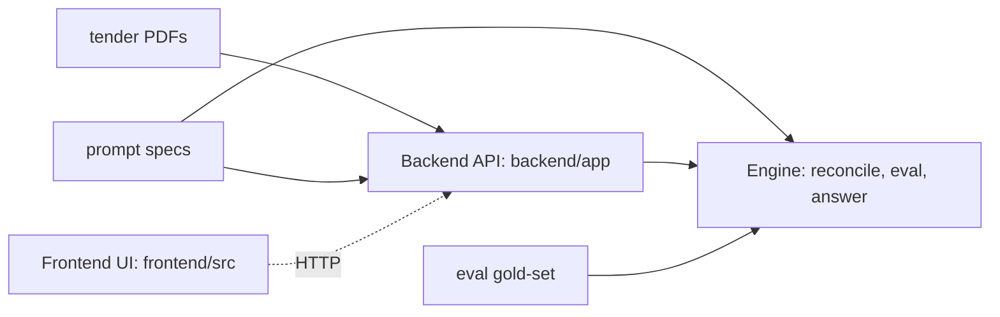
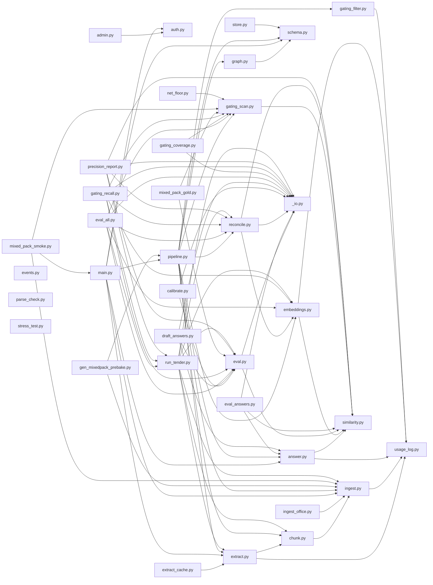

# CODEMAP — auto-generated map of this repository

> **Do not hand-edit.** Regenerated by `scripts/gen_codemap.py` every hour on `main` (`.github/workflows/codemap.yml`). To refresh locally: `python scripts/gen_codemap.py`.
>
> **Interactive graph:** [`frontend/public/codemap.html`](frontend/public/codemap.html) — drag / zoom / click-to-focus; served at `/codemap.html` on the Vercel deploy. (The diagrams below render right here on GitHub.)
>
> Map of commit `d844620` · 2026-07-11T23:59:40Z

**Read this first** for a current picture of the codebase — what lives where, and what imports what. It is the fast path to context for both humans and agents. If it looks wrong, it is stale: re-run the generator and push.

## Areas at a glance

| Area | Files | Lines | What it is |
|------|-------|-------|------------|
| **frontend** | 220 | 82,662 | Frontend — Next.js 16 / React 19 / Tailwind (compliance matrix UI) |
| **backend** | 23 | 4,635 | Backend — FastAPI (PDF ingest, extraction, REST API) |
| **engine** | 85 | 7,528 | Engine — reconcile / eval / answer-draft pipeline + tests |
| **prompts** | 7 | 778 | Prompts — LLM prompt specs (extraction, classification, answers, gaps) |
| **gold** | 8 | 375 | Eval gold-set — hand-labelled requirements for accuracy measurement |
| **data** | 17 | 0 | Data — tender source PDFs (not parsed here) |
| **comms** | 5 | 3,003 | Comms — async agent message boards |
| **docs** | 7 | 2,130 | Docs — plans & specs |
| **ci** | 1 | 57 | CI — GitHub Actions |
| **tooling** | 2 | 1,109 | Tooling — repo scripts (incl. this map generator) |
| **root** | 633 | 40,484 | Root — docs, config, role briefs |

## System shape



*Frontend ↔ Backend is an HTTP boundary (`frontend/src/lib/api.ts`), not an import — shown dashed. Everything else is a real code dependency.*

## Frontend module graph (`frontend/src`)

```mermaid
graph LR
  n0[answers/page.tsx] --> n1[AnswersBody.tsx]
  n0[answers/page.tsx] --> n2[AppMain.tsx]
  n0[answers/page.tsx] --> n3[DocumentHeader.tsx]
  n4[demo/page.tsx] --> n5[DemoView.tsx]
  n4[demo/page.tsx] --> n6[RequirementsContext.tsx]
  n4[demo/page.tsx] --> n7[site.ts]
  n4[demo/page.tsx] --> n8[requirement.ts]
  n9[faq/page.tsx] --> n10[SiteHeader.tsx]
  n9[faq/page.tsx] --> n11[json-ld.ts]
  n9[faq/page.tsx] --> n7[site.ts]
  n12[graph/page.tsx] --> n2[AppMain.tsx]
  n12[graph/page.tsx] --> n13[AuthGate.tsx]
  n12[graph/page.tsx] --> n3[DocumentHeader.tsx]
  n12[graph/page.tsx] --> n14[StructureView.tsx]
  n15[app/layout.tsx] --> n16[AuthContext.tsx]
  n15[app/layout.tsx] --> n6[RequirementsContext.tsx]
  n15[app/layout.tsx] --> n7[site.ts]
  n17[login/page.tsx] --> n18[GoogleSignInButton.tsx]
  n17[login/page.tsx] --> n10[SiteHeader.tsx]
  n17[login/page.tsx] --> n16[AuthContext.tsx]
  n17[login/page.tsx] --> n19[api.ts]
  n20[pack/page.tsx] --> n21[MatrixView.tsx]
  n20[pack/page.tsx] --> n6[RequirementsContext.tsx]
  n20[pack/page.tsx] --> n8[requirement.ts]
  n22[app/page.tsx] --> n23[Landing.tsx]
  n22[app/page.tsx] --> n11[json-ld.ts]
  n22[app/page.tsx] --> n7[site.ts]
  n24[pitch/page.tsx] --> n25[PitchDeck.tsx]
  n24[pitch/page.tsx] --> n6[RequirementsContext.tsx]
  n24[pitch/page.tsx] --> n8[requirement.ts]
  n26[review/page.tsx] --> n13[AuthGate.tsx]
  n26[review/page.tsx] --> n21[MatrixView.tsx]
  n26[review/page.tsx] --> n8[requirement.ts]
  n27[robots.ts] --> n7[site.ts]
  n28[showcase/page.tsx] --> n21[MatrixView.tsx]
  n28[showcase/page.tsx] --> n6[RequirementsContext.tsx]
  n28[showcase/page.tsx] --> n8[requirement.ts]
  n29[sitemap.ts] --> n7[site.ts]
  n30[teams/page.tsx] --> n2[AppMain.tsx]
  n30[teams/page.tsx] --> n13[AuthGate.tsx]
  n30[teams/page.tsx] --> n3[DocumentHeader.tsx]
  n30[teams/page.tsx] --> n31[TeamsManager.tsx]
  n32[thank-you/page.tsx] --> n10[SiteHeader.tsx]
  n33[upload/page.tsx] --> n13[AuthGate.tsx]
  n33[upload/page.tsx] --> n34[UploadWorkspace.tsx]
  n35[AccountMenu.tsx] --> n16[AuthContext.tsx]
  n36[ActivityControl.tsx] --> n16[AuthContext.tsx]
  n36[ActivityControl.tsx] --> n37[collaborators.ts]
  n36[ActivityControl.tsx] --> n38[useTenderActivity.ts]
  n39[AnswerCard.tsx] --> n40[AnswerPanel.tsx]
  n39[AnswerCard.tsx] --> n41[CategoryTag.tsx]
  n39[AnswerCard.tsx] --> n42[CollaborationMarkers.tsx]
  n39[AnswerCard.tsx] --> n43[ConfidenceIndicator.tsx]
  n39[AnswerCard.tsx] --> n44[OpenQuestions.tsx]
  n39[AnswerCard.tsx] --> n16[AuthContext.tsx]
  n39[AnswerCard.tsx] --> n45[answers.ts]
  n39[AnswerCard.tsx] --> n37[collaborators.ts]
  n39[AnswerCard.tsx] --> n46[source-doc.ts]
  n39[AnswerCard.tsx] --> n8[requirement.ts]
  n47[AnswerEvidenceOverlay.tsx] --> n8[requirement.ts]
  n48[AnswerFilterBar.tsx] --> n49[ExportMenu.tsx]
  n48[AnswerFilterBar.tsx] --> n45[answers.ts]
  n48[AnswerFilterBar.tsx] --> n8[requirement.ts]
  n40[AnswerPanel.tsx] --> n47[AnswerEvidenceOverlay.tsx]
  n40[AnswerPanel.tsx] --> n50[AnswerStateBadge.tsx]
  n40[AnswerPanel.tsx] --> n51[ApprovalStamp.tsx]
  n40[AnswerPanel.tsx] --> n16[AuthContext.tsx]
  n40[AnswerPanel.tsx] --> n6[RequirementsContext.tsx]
  n40[AnswerPanel.tsx] --> n37[collaborators.ts]
  n40[AnswerPanel.tsx] --> n8[requirement.ts]
  n50[AnswerStateBadge.tsx] --> n8[requirement.ts]
  n52[AnswerWorkspace.tsx] --> n39[AnswerCard.tsx]
  n52[AnswerWorkspace.tsx] --> n45[answers.ts]
  n52[AnswerWorkspace.tsx] --> n8[requirement.ts]
  n1[AnswersBody.tsx] --> n48[AnswerFilterBar.tsx]
  n1[AnswersBody.tsx] --> n52[AnswerWorkspace.tsx]
  n1[AnswersBody.tsx] --> n53[AutofillButton.tsx]
  n1[AnswersBody.tsx] --> n54[CapabilityUpload.tsx]
  n1[AnswersBody.tsx] --> n55[GapInterview.tsx]
  n1[AnswersBody.tsx] --> n56[NoTenderLoaded.tsx]
  n1[AnswersBody.tsx] --> n57[ReadinessLedger.tsx]
  n1[AnswersBody.tsx] --> n6[RequirementsContext.tsx]
  n1[AnswersBody.tsx] --> n45[answers.ts]
  n1[AnswersBody.tsx] --> n19[api.ts]
  n13[AuthGate.tsx] --> n16[AuthContext.tsx]
  n13[AuthGate.tsx] --> n19[api.ts]
  n53[AutofillButton.tsx] --> n58[AnimatedNumber.tsx]
  n53[AutofillButton.tsx] --> n6[RequirementsContext.tsx]
  n53[AutofillButton.tsx] --> n19[api.ts]
  n54[CapabilityUpload.tsx] --> n59[EvidenceLibrary.tsx]
  n54[CapabilityUpload.tsx] --> n6[RequirementsContext.tsx]
  n41[CategoryTag.tsx] --> n60[categoryStyle.ts]
  n42[CollaborationMarkers.tsx] --> n8[requirement.ts]
  n61[CommandPalette.tsx] --> n62[matrix-derive.ts]
  n61[CommandPalette.tsx] --> n46[source-doc.ts]
  n61[CommandPalette.tsx] --> n63[triage.ts]
  n64[CommentThread.tsx] --> n6[RequirementsContext.tsx]
  n64[CommentThread.tsx] --> n19[api.ts]
  n64[CommentThread.tsx] --> n37[collaborators.ts]
  n65[ComplianceMatrix.tsx] --> n41[CategoryTag.tsx]
  n65[ComplianceMatrix.tsx] --> n42[CollaborationMarkers.tsx]
  n65[ComplianceMatrix.tsx] --> n43[ConfidenceIndicator.tsx]
  n65[ComplianceMatrix.tsx] --> n16[AuthContext.tsx]
  n65[ComplianceMatrix.tsx] --> n37[collaborators.ts]
  n65[ComplianceMatrix.tsx] --> n66[dedupe.ts]
  n65[ComplianceMatrix.tsx] --> n62[matrix-derive.ts]
  n65[ComplianceMatrix.tsx] --> n46[source-doc.ts]
  n65[ComplianceMatrix.tsx] --> n63[triage.ts]
  n65[ComplianceMatrix.tsx] --> n8[requirement.ts]
  n67[ControlPanel.tsx] --> n6[RequirementsContext.tsx]
  n67[ControlPanel.tsx] --> n19[api.ts]
  n67[ControlPanel.tsx] --> n37[collaborators.ts]
  n67[ControlPanel.tsx] --> n46[source-doc.ts]
  n67[ControlPanel.tsx] --> n63[triage.ts]
  n68[CurrentTenderStrip.tsx] --> n6[RequirementsContext.tsx]
  n68[CurrentTenderStrip.tsx] --> n19[api.ts]
  n5[DemoView.tsx] --> n58[AnimatedNumber.tsx]
  n5[DemoView.tsx] --> n65[ComplianceMatrix.tsx]
  n5[DemoView.tsx] --> n69[GatingHero.tsx]
  n5[DemoView.tsx] --> n70[GraphView.tsx]
  n5[DemoView.tsx] --> n10[SiteHeader.tsx]
  n5[DemoView.tsx] --> n71[SourceVerifyOverlay.tsx]
  n5[DemoView.tsx] --> n72[DemoScrolly.tsx]
  n5[DemoView.tsx] --> n73[DemoTitleCard.tsx]
  n5[DemoView.tsx] --> n74[MountOnView.tsx]
  n5[DemoView.tsx] --> n75[sample.ts]
  n5[DemoView.tsx] --> n76[BookDemoButton.tsx]
  n5[DemoView.tsx] --> n77[BotanicalSprig.tsx]
  n5[DemoView.tsx] --> n78[ClosingArrival.tsx]
  n5[DemoView.tsx] --> n79[DrawOn.tsx]
  n5[DemoView.tsx] --> n80[Reveal.tsx]
  n5[DemoView.tsx] --> n81[SiteFooter.tsx]
  n5[DemoView.tsx] --> n82[FernFrond.tsx]
  n5[DemoView.tsx] --> n83[TreelineDivider.tsx]
  n5[DemoView.tsx] --> n6[RequirementsContext.tsx]
  n5[DemoView.tsx] --> n19[api.ts]
  n5[DemoView.tsx] --> n63[triage.ts]
  n3[DocumentHeader.tsx] --> n10[SiteHeader.tsx]
  n3[DocumentHeader.tsx] --> n84[WorkspacePresence.tsx]
  n3[DocumentHeader.tsx] --> n6[RequirementsContext.tsx]
  n3[DocumentHeader.tsx] --> n60[categoryStyle.ts]
  n3[DocumentHeader.tsx] --> n63[triage.ts]
  n85[DocxSourceView.tsx] --> n19[api.ts]
  n85[DocxSourceView.tsx] --> n86[dom-highlight.ts]
  n85[DocxSourceView.tsx] --> n87[text-match.ts]
  n59[EvidenceLibrary.tsx] --> n6[RequirementsContext.tsx]
  n49[ExportMenu.tsx] --> n88[ExportReadinessSummary.tsx]
  n49[ExportMenu.tsx] --> n6[RequirementsContext.tsx]
  n49[ExportMenu.tsx] --> n89[export-matrix-xlsx.ts]
  n49[ExportMenu.tsx] --> n90[export-readiness.ts]
  n49[ExportMenu.tsx] --> n91[export-response.ts]
  n49[ExportMenu.tsx] --> n8[requirement.ts]
  n88[ExportReadinessSummary.tsx] --> n90[export-readiness.ts]
  n92[FocusMode.tsx] --> n93[RequirementPanel.tsx]
  n92[FocusMode.tsx] --> n63[triage.ts]
  n92[FocusMode.tsx] --> n8[requirement.ts]
  n55[GapInterview.tsx] --> n50[AnswerStateBadge.tsx]
  n55[GapInterview.tsx] --> n41[CategoryTag.tsx]
  n55[GapInterview.tsx] --> n44[OpenQuestions.tsx]
  n55[GapInterview.tsx] --> n6[RequirementsContext.tsx]
  n55[GapInterview.tsx] --> n46[source-doc.ts]
  n69[GatingHero.tsx] --> n6[RequirementsContext.tsx]
  n69[GatingHero.tsx] --> n66[dedupe.ts]
  n69[GatingHero.tsx] --> n46[source-doc.ts]
  n69[GatingHero.tsx] --> n8[requirement.ts]
  n18[GoogleSignInButton.tsx] --> n19[api.ts]
  n70[GraphView.tsx] --> n41[CategoryTag.tsx]
  n70[GraphView.tsx] --> n43[ConfidenceIndicator.tsx]
  n70[GraphView.tsx] --> n6[RequirementsContext.tsx]
  n70[GraphView.tsx] --> n19[api.ts]
  n70[GraphView.tsx] --> n60[categoryStyle.ts]
  n70[GraphView.tsx] --> n46[source-doc.ts]
  n70[GraphView.tsx] --> n94[structure.ts]
  n70[GraphView.tsx] --> n8[requirement.ts]
  n95[MarksView.tsx] --> n6[RequirementsContext.tsx]
  n95[MarksView.tsx] --> n46[source-doc.ts]
  n95[MarksView.tsx] --> n94[structure.ts]
  n95[MarksView.tsx] --> n8[requirement.ts]
  n21[MatrixView.tsx] --> n58[AnimatedNumber.tsx]
  n21[MatrixView.tsx] --> n2[AppMain.tsx]
  n21[MatrixView.tsx] --> n51[ApprovalStamp.tsx]
  n21[MatrixView.tsx] --> n96[BulkActionBar.tsx]
  n21[MatrixView.tsx] --> n61[CommandPalette.tsx]
  n21[MatrixView.tsx] --> n65[ComplianceMatrix.tsx]
  n21[MatrixView.tsx] --> n67[ControlPanel.tsx]
  n21[MatrixView.tsx] --> n3[DocumentHeader.tsx]
  n21[MatrixView.tsx] --> n85[DocxSourceView.tsx]
  n21[MatrixView.tsx] --> n92[FocusMode.tsx]
  n21[MatrixView.tsx] --> n69[GatingHero.tsx]
  n21[MatrixView.tsx] --> n56[NoTenderLoaded.tsx]
  n21[MatrixView.tsx] --> n97[PdfSourceView.tsx]
  n21[MatrixView.tsx] --> n98[RequirementDrawer.tsx]
  n21[MatrixView.tsx] --> n93[RequirementPanel.tsx]
  n21[MatrixView.tsx] --> n99[RequirementSpine.tsx]
  n21[MatrixView.tsx] --> n100[SheetSourceView.tsx]
  n21[MatrixView.tsx] --> n101[SourceActionIcon.tsx]
  n21[MatrixView.tsx] --> n6[RequirementsContext.tsx]
  n21[MatrixView.tsx] --> n19[api.ts]
  n21[MatrixView.tsx] --> n89[export-matrix-xlsx.ts]
  n21[MatrixView.tsx] --> n62[matrix-derive.ts]
  n21[MatrixView.tsx] --> n46[source-doc.ts]
  n21[MatrixView.tsx] --> n87[text-match.ts]
  n21[MatrixView.tsx] --> n63[triage.ts]
  n21[MatrixView.tsx] --> n8[requirement.ts]
  n56[NoTenderLoaded.tsx] --> n6[RequirementsContext.tsx]
  n56[NoTenderLoaded.tsx] --> n19[api.ts]
  n44[OpenQuestions.tsx] --> n6[RequirementsContext.tsx]
  n44[OpenQuestions.tsx] --> n19[api.ts]
  n44[OpenQuestions.tsx] --> n8[requirement.ts]
  n97[PdfSourceView.tsx] --> n19[api.ts]
  n97[PdfSourceView.tsx] --> n87[text-match.ts]
  n102[ProcessingView.tsx] --> n58[AnimatedNumber.tsx]
  n102[ProcessingView.tsx] --> n19[api.ts]
  n57[ReadinessLedger.tsx] --> n49[ExportMenu.tsx]
  n57[ReadinessLedger.tsx] --> n45[answers.ts]
  n57[ReadinessLedger.tsx] --> n8[requirement.ts]
  n98[RequirementDrawer.tsx] --> n93[RequirementPanel.tsx]
  n98[RequirementDrawer.tsx] --> n8[requirement.ts]
  n93[RequirementPanel.tsx] --> n40[AnswerPanel.tsx]
  n93[RequirementPanel.tsx] --> n51[ApprovalStamp.tsx]
  n93[RequirementPanel.tsx] --> n41[CategoryTag.tsx]
  n93[RequirementPanel.tsx] --> n42[CollaborationMarkers.tsx]
  n93[RequirementPanel.tsx] --> n64[CommentThread.tsx]
  n93[RequirementPanel.tsx] --> n43[ConfidenceIndicator.tsx]
  n93[RequirementPanel.tsx] --> n101[SourceActionIcon.tsx]
  n93[RequirementPanel.tsx] --> n71[SourceVerifyOverlay.tsx]
  n93[RequirementPanel.tsx] --> n16[AuthContext.tsx]
  n93[RequirementPanel.tsx] --> n6[RequirementsContext.tsx]
  n93[RequirementPanel.tsx] --> n19[api.ts]
  n93[RequirementPanel.tsx] --> n37[collaborators.ts]
  n93[RequirementPanel.tsx] --> n46[source-doc.ts]
  n93[RequirementPanel.tsx] --> n8[requirement.ts]
  n99[RequirementSpine.tsx] --> n43[ConfidenceIndicator.tsx]
  n99[RequirementSpine.tsx] --> n63[triage.ts]
  n103[ShareControl.tsx] --> n6[RequirementsContext.tsx]
  n103[ShareControl.tsx] --> n19[api.ts]
  n103[ShareControl.tsx] --> n37[collaborators.ts]
  n100[SheetSourceView.tsx] --> n19[api.ts]
  n100[SheetSourceView.tsx] --> n87[text-match.ts]
  n10[SiteHeader.tsx] --> n35[AccountMenu.tsx]
  n10[SiteHeader.tsx] --> n104[BrandLogo.tsx]
  n10[SiteHeader.tsx] --> n105[SectionNav.tsx]
  n10[SiteHeader.tsx] --> n76[BookDemoButton.tsx]
  n71[SourceVerifyOverlay.tsx] --> n85[DocxSourceView.tsx]
  n71[SourceVerifyOverlay.tsx] --> n97[PdfSourceView.tsx]
  n71[SourceVerifyOverlay.tsx] --> n100[SheetSourceView.tsx]
  n71[SourceVerifyOverlay.tsx] --> n19[api.ts]
  n71[SourceVerifyOverlay.tsx] --> n46[source-doc.ts]
  n71[SourceVerifyOverlay.tsx] --> n87[text-match.ts]
  n71[SourceVerifyOverlay.tsx] --> n8[requirement.ts]
  n14[StructureView.tsx] --> n70[GraphView.tsx]
  n14[StructureView.tsx] --> n95[MarksView.tsx]
  n14[StructureView.tsx] --> n56[NoTenderLoaded.tsx]
  n14[StructureView.tsx] --> n98[RequirementDrawer.tsx]
  n14[StructureView.tsx] --> n6[RequirementsContext.tsx]
  n14[StructureView.tsx] --> n19[api.ts]
  n14[StructureView.tsx] --> n94[structure.ts]
  n14[StructureView.tsx] --> n63[triage.ts]
  n14[StructureView.tsx] --> n8[requirement.ts]
  n31[TeamsManager.tsx] --> n19[api.ts]
  n31[TeamsManager.tsx] --> n37[collaborators.ts]
  n106[TendersList.tsx] --> n6[RequirementsContext.tsx]
  n106[TendersList.tsx] --> n19[api.ts]
  n107[UploadDropzone.tsx] --> n102[ProcessingView.tsx]
  n107[UploadDropzone.tsx] --> n108[RegisterPreview.tsx]
  n107[UploadDropzone.tsx] --> n6[RequirementsContext.tsx]
  n107[UploadDropzone.tsx] --> n109[demo-tender.ts]
  n107[UploadDropzone.tsx] --> n19[api.ts]
  n107[UploadDropzone.tsx] --> n46[source-doc.ts]
  n107[UploadDropzone.tsx] --> n8[requirement.ts]
  n34[UploadWorkspace.tsx] --> n2[AppMain.tsx]
  n34[UploadWorkspace.tsx] --> n68[CurrentTenderStrip.tsx]
  n34[UploadWorkspace.tsx] --> n3[DocumentHeader.tsx]
  n34[UploadWorkspace.tsx] --> n21[MatrixView.tsx]
  n34[UploadWorkspace.tsx] --> n106[TendersList.tsx]
  n34[UploadWorkspace.tsx] --> n107[UploadDropzone.tsx]
  n34[UploadWorkspace.tsx] --> n109[demo-tender.ts]
  n84[WorkspacePresence.tsx] --> n36[ActivityControl.tsx]
  n84[WorkspacePresence.tsx] --> n103[ShareControl.tsx]
  n72[DemoScrolly.tsx] --> n74[MountOnView.tsx]
  n72[DemoScrolly.tsx] --> n110[ScrollyStage.tsx]
  n72[DemoScrolly.tsx] --> n111[steps.ts]
  n72[DemoScrolly.tsx] --> n112[useScrollTimeline.ts]
  n72[DemoScrolly.tsx] --> n76[BookDemoButton.tsx]
  n73[DemoTitleCard.tsx] --> n75[sample.ts]
  n73[DemoTitleCard.tsx] --> n83[TreelineDivider.tsx]
  n110[ScrollyStage.tsx] --> n51[ApprovalStamp.tsx]
  n110[ScrollyStage.tsx] --> n41[CategoryTag.tsx]
  n110[ScrollyStage.tsx] --> n42[CollaborationMarkers.tsx]
  n110[ScrollyStage.tsx] --> n43[ConfidenceIndicator.tsx]
  n110[ScrollyStage.tsx] --> n69[GatingHero.tsx]
  n110[ScrollyStage.tsx] --> n70[GraphView.tsx]
  n110[ScrollyStage.tsx] --> n113[GhostCursor.tsx]
  n110[ScrollyStage.tsx] --> n114[StageChrome.tsx]
  n110[ScrollyStage.tsx] --> n75[sample.ts]
  n110[ScrollyStage.tsx] --> n111[steps.ts]
  n110[ScrollyStage.tsx] --> n82[FernFrond.tsx]
  n110[ScrollyStage.tsx] --> n115[PineBranch.tsx]
  n75[sample.ts] --> n8[requirement.ts]
  n78[ClosingArrival.tsx] --> n76[BookDemoButton.tsx]
  n78[ClosingArrival.tsx] --> n79[DrawOn.tsx]
  n78[ClosingArrival.tsx] --> n80[Reveal.tsx]
  n78[ClosingArrival.tsx] --> n115[PineBranch.tsx]
  n78[ClosingArrival.tsx] --> n116[Seal.tsx]
  n78[ClosingArrival.tsx] --> n83[TreelineDivider.tsx]
  n117[ForestHeroLayers.tsx] --> n116[Seal.tsx]
  n118[HeroResolve.tsx] --> n65[ComplianceMatrix.tsx]
  n118[HeroResolve.tsx] --> n69[GatingHero.tsx]
  n118[HeroResolve.tsx] --> n6[RequirementsContext.tsx]
  n118[HeroResolve.tsx] --> n63[triage.ts]
  n23[Landing.tsx] --> n43[ConfidenceIndicator.tsx]
  n23[Landing.tsx] --> n10[SiteHeader.tsx]
  n23[Landing.tsx] --> n76[BookDemoButton.tsx]
  n23[Landing.tsx] --> n78[ClosingArrival.tsx]
  n23[Landing.tsx] --> n119[CredibilityBand.tsx]
  n23[Landing.tsx] --> n79[DrawOn.tsx]
  n23[Landing.tsx] --> n117[ForestHeroLayers.tsx]
  n23[Landing.tsx] --> n118[HeroResolve.tsx]
  n23[Landing.tsx] --> n120[HowItWorks.tsx]
  n23[Landing.tsx] --> n121[ProductShots.tsx]
  n23[Landing.tsx] --> n122[ProofScrolly.tsx]
  n23[Landing.tsx] --> n80[Reveal.tsx]
  n23[Landing.tsx] --> n81[SiteFooter.tsx]
  n23[Landing.tsx] --> n123[TrailDescent.tsx]
  n23[Landing.tsx] --> n115[PineBranch.tsx]
  n23[Landing.tsx] --> n124[PressedLeaf.tsx]
  n23[Landing.tsx] --> n116[Seal.tsx]
  n23[Landing.tsx] --> n83[TreelineDivider.tsx]
  n121[ProductShots.tsx] --> n50[AnswerStateBadge.tsx]
  n121[ProductShots.tsx] --> n51[ApprovalStamp.tsx]
  n121[ProductShots.tsx] --> n41[CategoryTag.tsx]
  n121[ProductShots.tsx] --> n43[ConfidenceIndicator.tsx]
  n122[ProofScrolly.tsx] --> n58[AnimatedNumber.tsx]
  n122[ProofScrolly.tsx] --> n125[ProofNumbers.tsx]
  n122[ProofScrolly.tsx] --> n80[Reveal.tsx]
  n81[SiteFooter.tsx] --> n104[BrandLogo.tsx]
  n81[SiteFooter.tsx] --> n76[BookDemoButton.tsx]
  n81[SiteFooter.tsx] --> n115[PineBranch.tsx]
  n81[SiteFooter.tsx] --> n116[Seal.tsx]
  n81[SiteFooter.tsx] --> n83[TreelineDivider.tsx]
  n116[Seal.tsx] --> n77[BotanicalSprig.tsx]
  n25[PitchDeck.tsx] --> n58[AnimatedNumber.tsx]
  n25[PitchDeck.tsx] --> n104[BrandLogo.tsx]
  n25[PitchDeck.tsx] --> n65[ComplianceMatrix.tsx]
  n25[PitchDeck.tsx] --> n69[GatingHero.tsx]
  n25[PitchDeck.tsx] --> n21[MatrixView.tsx]
  n25[PitchDeck.tsx] --> n121[ProductShots.tsx]
  n25[PitchDeck.tsx] --> n126[PitchScene.tsx]
  n25[PitchDeck.tsx] --> n127[TenderGlyph.tsx]
  n25[PitchDeck.tsx] --> n128[TenderPageFacsimile.tsx]
  n25[PitchDeck.tsx] --> n129[TrailMap.tsx]
  n25[PitchDeck.tsx] --> n130[TrailSteps.tsx]
  n25[PitchDeck.tsx] --> n6[RequirementsContext.tsx]
  n25[PitchDeck.tsx] --> n63[triage.ts]
  n126[PitchScene.tsx] --> n82[FernFrond.tsx]
  n126[PitchScene.tsx] --> n115[PineBranch.tsx]
  n126[PitchScene.tsx] --> n116[Seal.tsx]
  n16[AuthContext.tsx] --> n19[api.ts]
  n6[RequirementsContext.tsx] --> n16[AuthContext.tsx]
  n6[RequirementsContext.tsx] --> n109[demo-tender.ts]
  n6[RequirementsContext.tsx] --> n131[answer-store.ts]
  n6[RequirementsContext.tsx] --> n45[answers.ts]
  n6[RequirementsContext.tsx] --> n19[api.ts]
  n6[RequirementsContext.tsx] --> n8[requirement.ts]
  n109[demo-tender.ts] --> n8[requirement.ts]
  n132[mock-requirements.ts] --> n8[requirement.ts]
  n131[answer-store.ts] --> n8[requirement.ts]
  n45[answers.ts] --> n63[triage.ts]
  n45[answers.ts] --> n8[requirement.ts]
  n19[api.ts] --> n8[requirement.ts]
  n37[collaborators.ts] --> n8[requirement.ts]
  n66[dedupe.ts] --> n8[requirement.ts]
  n86[dom-highlight.ts] --> n87[text-match.ts]
  n89[export-matrix-xlsx.ts] --> n43[ConfidenceIndicator.tsx]
  n89[export-matrix-xlsx.ts] --> n91[export-response.ts]
  n89[export-matrix-xlsx.ts] --> n46[source-doc.ts]
  n89[export-matrix-xlsx.ts] --> n8[requirement.ts]
  n90[export-readiness.ts] --> n45[answers.ts]
  n90[export-readiness.ts] --> n8[requirement.ts]
  n91[export-response.ts] --> n46[source-doc.ts]
  n91[export-response.ts] --> n8[requirement.ts]
  n62[matrix-derive.ts] --> n66[dedupe.ts]
  n62[matrix-derive.ts] --> n94[structure.ts]
  n62[matrix-derive.ts] --> n63[triage.ts]
  n62[matrix-derive.ts] --> n8[requirement.ts]
  n46[source-doc.ts] --> n19[api.ts]
  n46[source-doc.ts] --> n8[requirement.ts]
  n94[structure.ts] --> n8[requirement.ts]
  n87[text-match.ts] --> n66[dedupe.ts]
  n63[triage.ts] --> n8[requirement.ts]
  n38[useTenderActivity.ts] --> n6[RequirementsContext.tsx]
  n38[useTenderActivity.ts] --> n19[api.ts]
  n38[useTenderActivity.ts] --> n8[requirement.ts]
  n133[error.tsx]
  n134[tenders/page.tsx]
```

## Backend + Engine module graph (Python, tests excluded)



## Files by area

### frontend — Frontend — Next.js 16 / React 19 / Tailwind (compliance matrix UI)

- `frontend/.env.example`
- `frontend/.gitignore`
- `frontend/AGENTS.md`
- `frontend/CLAUDE.md`
- `frontend/DESIGN-SYSTEM.md`
- `frontend/README.md`
- `frontend/SLOP-CHECK.md`
- `frontend/UI/UX/Motion Overhaul/MOTION.md`
- `frontend/UI/UX/Motion Overhaul/QA.md`
- `frontend/UI/UX/Motion Overhaul/UI-IMPROVEMENT-PLAN.md`
- `frontend/UI/UX/Motion Overhaul/UX-OVERHAUL-BRIEF.md`
- `frontend/UI/UX/Motion Overhaul/delete.md`
- `frontend/UI/UX/Motion Overhaul/implementation.md`
- `frontend/UI/UX/Motion Overhaul/stage-1-control-audit.md`
- `frontend/copywriting.md`
- `frontend/design-language.md`
- `frontend/design-uplift.md`
- `frontend/design/colours.html`
- `frontend/design/type-specimen.html`
- `frontend/design/typography.html`
- `frontend/design/warmth.html`
- `frontend/eslint.config.mjs`
- `frontend/landing-page-brief.md`
- `frontend/layout.md`
- `frontend/next.config.ts`
- `frontend/package-lock.json`
- `frontend/package.json`
- `frontend/postcss.config.mjs`
- `frontend/public/brand/README.md`
- `frontend/public/codemap.html`
- `frontend/public/demo/mixed-pack/sample-compliance.csv`
- `frontend/public/demo/mixed-pack/sample-pricing-schedule.xlsx`
- `frontend/public/demo/mixed-pack/sample-return-forms.docx`
- `frontend/public/llms.txt`
- `frontend/public/pdf.worker.min.mjs` — @licstart The following is the entire license notice for the
- `frontend/src/app/answers/page.tsx` — exports `metadata`
- `frontend/src/app/demo/page.tsx` — exports `metadata`
- `frontend/src/app/error.tsx` — exports `Error`
- `frontend/src/app/faq/page.tsx` — exports `metadata`
- `frontend/src/app/globals.css`
- `frontend/src/app/graph/page.tsx` — exports `metadata`
- `frontend/src/app/layout.tsx` — exports `metadata`
- `frontend/src/app/login/page.tsx` — exports `LoginPage`
- `frontend/src/app/pack/page.tsx` — exports `metadata`
- `frontend/src/app/page.tsx` — exports `metadata`
- `frontend/src/app/pitch/page.tsx` — exports `metadata`
- `frontend/src/app/review/page.tsx` — exports `ReviewPage`
- `frontend/src/app/robots.ts` — exports `robots`
- `frontend/src/app/showcase/page.tsx` — exports `metadata`
- `frontend/src/app/sitemap.ts` — exports `sitemap`
- `frontend/src/app/teams/page.tsx` — exports `metadata`
- `frontend/src/app/tenders/page.tsx` — exports `TendersPage`
- `frontend/src/app/thank-you/page.tsx` — exports `metadata`
- `frontend/src/app/upload/page.tsx` — exports `metadata`
- `frontend/src/components/AccountMenu.tsx` — exports `AccountMenu`
- `frontend/src/components/ActivityControl.tsx` — exports `ActivityControl`
- `frontend/src/components/AnimatedNumber.tsx` — exports `AnimatedNumber`
- `frontend/src/components/AnswerCard.tsx` — exports `AnswerCard`
- `frontend/src/components/AnswerEvidenceOverlay.tsx` — exports `AnswerEvidenceOverlay`
- `frontend/src/components/AnswerFilterBar.tsx` — exports `AnswerFilterBar`
- `frontend/src/components/AnswerPanel.module.css`
- `frontend/src/components/AnswerPanel.tsx` — exports `AnswerPanel`
- `frontend/src/components/AnswerStateBadge.tsx` — exports `AnswerStateBadge`
- `frontend/src/components/AnswerWorkspace.tsx` — exports `AnswerWorkspace`
- `frontend/src/components/AnswersBody.tsx` — exports `AnswersBody`
- `frontend/src/components/AppMain.tsx` — The shared page container (layout.md section 8): one centred column capped at
- `frontend/src/components/ApprovalStamp.tsx` — The approval stamp (design-language.md, device 6): a clean forest mark set
- `frontend/src/components/AuthGate.tsx` — exports `AuthGate`
- `frontend/src/components/AutofillButton.tsx` — exports `AutofillButton`
- `frontend/src/components/BrandLogo.tsx` — The Bidframe lockup: a crisp clause frame plus the Fraunces wordmark,
- `frontend/src/components/BulkActionBar.tsx` — exports `BulkActionBar`
- `frontend/src/components/CapabilityUpload.tsx` — exports `CapabilityUpload`
- `frontend/src/components/CategoryTag.tsx` — exports `CategoryDot`
- `frontend/src/components/CollaborationMarkers.tsx` — exports `CommentCountMarker`
- `frontend/src/components/CommandPalette.tsx` — exports `CommandPaletteProps`
- `frontend/src/components/CommentThread.tsx` — exports `CommentThread`
- `frontend/src/components/ComplianceMatrix.tsx` — exports `Density`
- `frontend/src/components/ConfidenceIndicator.tsx` — The confidence indicator (DESIGN-SYSTEM section 4, axis 1). Four tiers, worst
- `frontend/src/components/ControlPanel.tsx` — exports `ControlPanel`
- `frontend/src/components/CurrentTenderStrip.tsx` — exports `CurrentTenderStrip`
- `frontend/src/components/DemoView.tsx` — exports `DemoView`
- `frontend/src/components/DocumentHeader.tsx` — exports `DocumentHeader`
- `frontend/src/components/DocxSourceView.tsx` — exports `DocxSourceView`
- `frontend/src/components/EvidenceLibrary.tsx` — exports `EvidenceLibrary`
- `frontend/src/components/ExportMenu.module.css`
- `frontend/src/components/ExportMenu.tsx` — exports `ExportMenu`
- `frontend/src/components/ExportReadinessSummary.tsx` — exports `ExportReadinessSummary`
- `frontend/src/components/FocusMode.tsx` — exports `FocusMode`
- `frontend/src/components/GapInterview.tsx` — exports `GapInterview`
- `frontend/src/components/GatingHero.tsx` — exports `GatingHero`
- `frontend/src/components/GoogleSignInButton.tsx` — exports `GoogleSignInButton`
- `frontend/src/components/GraphView.module.css`
- `frontend/src/components/GraphView.tsx` — exports `GraphView`
- `frontend/src/components/MarksView.tsx` — exports `MarksView`
- `frontend/src/components/MatrixView.tsx` — exports `MatrixView`
- `frontend/src/components/NoTenderLoaded.tsx` — exports `NoTenderLoaded`
- `frontend/src/components/OpenQuestions.tsx` — exports `OpenQuestions`
- `frontend/src/components/PdfSourceView.tsx` — exports `PdfSourceView`
- `frontend/src/components/ProcessingView.module.css`
- `frontend/src/components/ProcessingView.tsx` — exports `ProcessingView`
- `frontend/src/components/ReadinessLedger.tsx` — exports `ReadinessLedger`
- `frontend/src/components/RegisterPreview.module.css`
- `frontend/src/components/RegisterPreview.tsx` — exports `RegisterPreview`
- `frontend/src/components/RequirementDrawer.tsx` — exports `RequirementDrawer`
- `frontend/src/components/RequirementPanel.tsx` — exports `PanelVariant`
- `frontend/src/components/RequirementSpine.tsx` — exports `RequirementSpine`
- `frontend/src/components/SectionNav.tsx` — exports `SectionNav`
- `frontend/src/components/ShareControl.tsx` — exports `ShareControl`
- `frontend/src/components/SheetSourceView.tsx` — exports `SheetSourceView`
- `frontend/src/components/SiteHeader.tsx` — exports `SiteHeader`
- `frontend/src/components/SourceActionIcon.tsx` — One small source glyph shared by every "look at the source" action — the
- `frontend/src/components/SourceVerifyOverlay.tsx` — exports `SourceVerifyOverlay`
- `frontend/src/components/StructureView.tsx` — exports `StructureView`
- `frontend/src/components/TeamsManager.tsx` — exports `TeamsManager`
- `frontend/src/components/TendersList.tsx` — exports `TendersList`
- `frontend/src/components/UploadDropzone.tsx` — exports `UploadDropzone`
- `frontend/src/components/UploadWorkspace.tsx` — exports `UploadWorkspace`
- `frontend/src/components/WorkspacePresence.tsx` — exports `WorkspacePresence`
- `frontend/src/components/demo/DemoScrolly.tsx` — exports `DemoScrolly`
- `frontend/src/components/demo/DemoTitleCard.tsx` — exports `DemoTitleCard`
- `frontend/src/components/demo/GhostCursor.tsx` — exports `GhostCursor`
- `frontend/src/components/demo/MountOnView.tsx` — exports `MountOnView`
- `frontend/src/components/demo/ScrollyStage.tsx` — exports `BeatVisual`
- `frontend/src/components/demo/StageChrome.tsx` — exports `StageChrome`
- `frontend/src/components/demo/sample.ts` — exports `SAMPLE`
- `frontend/src/components/demo/steps.ts` — The script for the /demo cinematic scroll. Each step is one narrative beat
- `frontend/src/components/demo/useScrollTimeline.ts` — exports `useScrollTimeline`
- `frontend/src/components/landing/BookDemoButton.tsx` — exports `BookDemoButton`
- `frontend/src/components/landing/BotanicalSprig.tsx` — A botanical laurel sprig in line-art, used to frame the hero and the tilted
- `frontend/src/components/landing/ClosingArrival.tsx` — exports `ClosingArrival`
- `frontend/src/components/landing/CredibilityBand.tsx` — exports `CredibilityBand`
- `frontend/src/components/landing/DrawOn.tsx` — exports `DrawOn`
- `frontend/src/components/landing/ForestHeroLayers.tsx` — exports `ForestHeroLayers`
- `frontend/src/components/landing/HeroResolve.tsx` — exports `HeroResolve`
- `frontend/src/components/landing/HowItWorks.tsx` — exports `HowItWorks`
- `frontend/src/components/landing/Landing.tsx` — exports `Landing`
- `frontend/src/components/landing/ProductShots.tsx` — Three product shots for the landing page: a priority queue, a traceable source
- `frontend/src/components/landing/ProofNumbers.tsx` — The proof ledger on the pine band: three poster-scale mono figures, each
- `frontend/src/components/landing/ProofScrolly.tsx` — exports `ProofScrolly`
- `frontend/src/components/landing/Reveal.tsx` — exports `Reveal`
- `frontend/src/components/landing/SiteFooter.tsx` — exports `SiteFooter`
- `frontend/src/components/landing/TrailDescent.tsx` — exports `TrailDescent`
- `frontend/src/components/landing/art/FernFrond.tsx` — A large fern frond in the landing's engraving language, drawn to bleed off
- `frontend/src/components/landing/art/PineBranch.tsx` — A horizontal pine branch in the landing's engraving language, laid along the
- `frontend/src/components/landing/art/PressedLeaf.tsx` — A small pressed-leaf section mark in the landing's engraving language, sized
- `frontend/src/components/landing/art/Seal.tsx` — exports `Seal`
- `frontend/src/components/landing/art/TreelineDivider.tsx` — A treeline horizon used as the seam between the paper page and the pine
- `frontend/src/components/pitch/PitchDeck.tsx` — exports `PitchDeck`
- `frontend/src/components/pitch/PitchScene.tsx` — exports `PitchZone`
- `frontend/src/components/pitch/TenderGlyph.tsx` — exports `TenderStage`
- `frontend/src/components/pitch/TenderPageFacsimile.tsx` — A typeset facsimile of the Bradwell tender's page 7 — the clause 4.6 wall of
- `frontend/src/components/pitch/TrailMap.tsx` — exports `TrailMap`
- `frontend/src/components/pitch/TrailSteps.tsx` — The journey slide's route register: four stations on one straight drawn
- `frontend/src/context/AuthContext.tsx` — exports `AuthProvider`
- `frontend/src/context/RequirementsContext.tsx` — exports `DraftRun`
- `frontend/src/data/bradwell-prebake.json`
- `frontend/src/data/demo-tender.ts` — exports `loadDemoTender`
- `frontend/src/data/mixedpack-prebake.json`
- `frontend/src/data/mock-requirements.ts` — exports `mockTender`
- `frontend/src/data/nhs-prebake.json`
- `frontend/src/data/spso-prebake.json`
- `frontend/src/lib/answer-store.ts` — exports `PersistedAnswer`
- `frontend/src/lib/answers.ts` — exports `unansweredCount`
- `frontend/src/lib/api.ts` — exports `isApiEnabled`
- `frontend/src/lib/categoryStyle.ts` — Category colour coding (the "index tab" layer). Each requirement category gets
- `frontend/src/lib/collaborators.ts` — exports `Collaborator`
- `frontend/src/lib/dedupe.ts` — exports `JACCARD_THRESHOLD`
- `frontend/src/lib/dom-highlight.ts` — exports `highlightExcerptInHtml`
- `frontend/src/lib/export-matrix-xlsx.ts` — exports `MatrixXlsxInput`
- `frontend/src/lib/export-readiness.ts` — exports `ExportBlockerKind`
- `frontend/src/lib/export-response.ts` — exports `ExportAudience`
- `frontend/src/lib/json-ld.ts` — exports `jsonLd`
- `frontend/src/lib/matrix-derive.ts` — exports `MatrixLens`
- `frontend/src/lib/site.ts` — exports `SITE_URL`
- `frontend/src/lib/source-doc.ts` — exports `SourceDocumentKind`
- `frontend/src/lib/structure.ts` — exports `UNASSIGNED`
- `frontend/src/lib/text-match.ts` — exports `MatchKind`
- `frontend/src/lib/triage.ts` — exports `GroupKey`
- `frontend/src/lib/useTenderActivity.ts` — exports `ActivityEntry`
- `frontend/src/types/requirement.ts` — exports `RequirementType`
- `frontend/tsconfig.json`
- `frontend/vercel.json`
- *(+38 binary/asset file(s))*

### backend — Backend — FastAPI (PDF ingest, extraction, REST API)

- `backend/.env.example`
- `backend/DEPLOY.md`
- `backend/Dockerfile`
- `backend/README.md`
- `backend/app/__init__.py` — Tender Breakdown backend package.
- `backend/app/admin.py` — command-line account management for the invite-only auth.
- `backend/app/auth.py` — self-hosted, invite-only authentication.
- `backend/app/chunk.py` — page-aware overlapping chunker.
- `backend/app/events.py` — in-memory per-tender pub/sub for live collaboration (SSE).
- `backend/app/extract.py` — chunk → raw requirement objects.
- `backend/app/extract_cache.py` — content-addressed cache for the expensive LLM extraction step.
- `backend/app/graph.py` — relationship edges (criteria_ref · depends_on).
- `backend/app/ingest.py` — PDF → page-numbered text.
- `backend/app/ingest_office.py` — Word / Excel / CSV -> page-numbered text.
- `backend/app/main.py` — Tender Breakdown API — FastAPI app.
- `backend/app/pipeline.py` — ingest → chunk → extract → assemble.
- `backend/app/schema.py` — the locked data contract as Pydantic models.
- `backend/app/store.py` — SQLite persistence (stdlib sqlite3, zero-config).
- `backend/requirements.txt`
- `backend/scripts/gen_mixedpack_prebake.py` — freeze a mixed-pack demo snapshot (J-092).
- `backend/scripts/parse_check.py` — hour-one tender sanity check.
- `backend/scripts/stress_test.py` — throw real tenders at the full backend and log what breaks.
- `backend/scripts/tender-sources.txt`

### engine — Engine — reconcile / eval / answer-draft pipeline + tests

- `engine/.gitignore`
- `engine/README.md`
- `engine/__init__.py` — Bidframe engine package (Generalist lane): reconcile/dedupe + eval harness.
- `engine/_io.py` — UTF-8-safe JSON I/O. This box defaults to cp1252 (J-008 crash); never rely on it.
- `engine/answer.py` — auditable autofill: grounded answer-draft + gap interview (Generalist lane).
- `engine/embeddings.py` — optional semantic dedup for reconcile (J-056, Generalist).
- `engine/eval.py` — Eval harness: score tool output against a hand-labelled gold set.
- `engine/eval_answers.py` — groundedness eval for auditable autofill (Generalist lane).
- `engine/fixtures/capability/cap-001-company-profile.txt`
- `engine/fixtures/capability/cap-002-case-studies.txt`
- `engine/fixtures/capability/cap-003-policies.txt`
- `engine/fixtures/capability/cap-004-method-statement.txt`
- `engine/fixtures/capability/cap-005-experience-personnel.txt`
- `engine/fixtures/capability/cap-006-commercial-terms.txt`
- `engine/fixtures/capability/cap-007-client-references.txt`
- `engine/fixtures/capability/cap-008-insurance.txt`
- `engine/fixtures/capability/cap-009-health-safety-coshh.txt`
- `engine/fixtures/capability/cap-010-quality-assurance.txt`
- `engine/gating_filter.py` — MODEL precision filter for the generous gating safety-net.
- `engine/gating_scan.py` — deterministic disqualifier SAFETY NET (never miss a deal-breaker).
- `engine/gold/mock.gold.json`
- `engine/reconcile.py` — Reconcile/dedupe — pipeline step 5 (Generalist lane).
- `engine/requirements.txt`
- `engine/scripts/__init__.py`
- `engine/scripts/calibrate.py` — data-driven calibration of the needs_review threshold.
- `engine/scripts/draft_answers.py` — the auditable-autofill demo run.
- `engine/scripts/eval_all.py` — aggregate accuracy across every labelled tender.
- `engine/scripts/gating_coverage.py` — gate-FAMILY coverage diagnostic for the public-sector safety-net.
- `engine/scripts/gating_recall.py` — the TRUE gating-recall number (semantic + auditable).
- `engine/scripts/mixed_pack_gold.py` — Score the deterministic net against the synthetic mixed-pack gold set.
- `engine/scripts/mixed_pack_smoke.py` — one-command release gate for the mixed-pack sprint (lane 04 / J).
- `engine/scripts/net_floor.py` — the deterministic deal-breaker floor, offline and reproducible.
- `engine/scripts/precision_report.py` — categorise extraction false-positives vs a gold set.
- `engine/scripts/run_tender.py` — the real closed loop on a real tender.
- `engine/similarity.py` — Swappable similarity seam. difflib char-ratio + content-token Jaccard. No embeddings.
- `engine/tests/__init__.py`
- `engine/tests/conftest.py` — Pytest config for engine tests. Run from repo root: python -m pytest engine/tests/ -v
- `engine/tests/fixtures/eval_gold_syn.json`
- `engine/tests/fixtures/eval_output_syn.json`
- `engine/tests/fixtures/golden_final.json`
- `engine/tests/fixtures/mock_raw_extraction.json`
- `engine/tests/test_adversarial_safety.py` — Adversarial trust-invariant suite — a judge-style attack battery on the four
- `engine/tests/test_answer.py`
- `engine/tests/test_assign_ids.py`
- `engine/tests/test_autofill_wiring.py` — Integration: auditable autofill is wired into the live API (generalist lane).
- `engine/tests/test_backend_extract.py` — Regression tests for backend/app/extract.py — the Day-4 accuracy pass (P).
- `engine/tests/test_calibrate.py`
- `engine/tests/test_collaboration.py` — Collaboration (J covering — spans backend lanes): shared-tender access + attributed decisions.
- `engine/tests/test_demo_no_bluff.py` — Regression lock for the SECOND headline trust claim: the demo never bluffs.
- `engine/tests/test_draft_concurrency.py` — draft_all parallelism: drafting concurrently must be byte-identical to sequential.
- `engine/tests/test_embedding_dedup.py` — Embedding semantic dedup (J-056, Generalist).
- `engine/tests/test_end_to_end.py`
- `engine/tests/test_eval_all.py`
- `engine/tests/test_eval_answers.py` — Groundedness eval — turns "the autofill never bluffs" into an auditable number.
- `engine/tests/test_eval_gold_csv.py`
- `engine/tests/test_eval_integration.py` — The closed Generalist loop: reconcile(mock raw) -> score vs mock.gold.json.
- `engine/tests/test_eval_match.py`
- `engine/tests/test_eval_metrics.py`
- `engine/tests/test_eval_report.py`
- `engine/tests/test_extract_cache.py` — Regression tests for backend/app/extract_cache.py — content-addressed extraction cache.
- `engine/tests/test_gap_questions.py` — Sharper gap questions: the OpenAI answerer phrases the gap interview via J's
- `engine/tests/test_gating_filter.py` — The model precision filter must improve precision without EVER lowering the recall floor:
- `engine/tests/test_gating_scan.py` — gating_scan safety net: surfaces disqualifier lines extraction missed, stays quiet when covered.
- `engine/tests/test_grouping.py`
- `engine/tests/test_ingest_ocr.py` — Deterministic test of the scanned/image-only-PDF vision-OCR fallback in backend.app.ingest.
- `engine/tests/test_ingest_office.py` — Mixed-pack ingestion (backend lane, B-022): Word/Excel/CSV -> IngestedDoc.
- `engine/tests/test_io.py`
- `engine/tests/test_match_score.py` — Eval matcher: paraphrase/granularity tolerance without embeddings.
- `engine/tests/test_merge.py`
- `engine/tests/test_mixed_pack_engine.py` — Mixed-pack engine/eval lane (generalist, ops/mixed-pack-02-engine-eval.md).
- `engine/tests/test_mixed_pack_gold.py` — Mixed-pack gold scorer: the planted DOCX/XLSX/CSV gates stay measurable.
- `engine/tests/test_net_floor.py` — Regression lock for the deterministic deal-breaker floor (the demo's headline proof).
- `engine/tests/test_pipeline_wiring.py` — Integration: the backend pipeline now uses the generalist engine for reconcile + routing.
- `engine/tests/test_real_data_robustness.py` — Robustness against real extractor output (regression for the SPSO run).
- `engine/tests/test_report.py`
- `engine/tests/test_semantic_gating.py` — Region-anchored semantic gating recall (J-062 #3 / J-063).
- `engine/tests/test_similarity.py`
- `engine/tests/test_source_file_endpoint.py` — GET /tenders/{id}/source: serves any pack document (PDF/DOCX/XLSX/CSV) inline in
- `engine/tests/test_source_rect.py` — Regression tests for source_rect highlight coordinates (J-049 P3, backend/app/pipeline.py).
- `engine/tests/test_teams_comments.py` — Teams + comments + Google provisioning (extend of the self-hosted auth, Generalist lane).
- `engine/tests/test_to_final.py`
- `engine/tests/test_upload_mixed_pack.py` — Mixed-pack upload (backend lane, B-022): POST /tenders/upload accepts PDF + Word +
- `engine/tests/test_upload_zip_pack.py` — ZIP-pack upload (backend lane, J-096): POST /tenders/upload accepts a single .zip
- `engine/tests/test_usage_log.py` — Regression tests for engine/usage_log.py — OpenAI spend visibility (J-055/J-058).
- `engine/usage_log.py` — cheap OpenAI spend visibility (J-055) + persistent ledger (J-058).

### prompts — Prompts — LLM prompt specs (extraction, classification, answers, gaps)

- `prompts/answer-generation.md`
- `prompts/classification.md`
- `prompts/extraction.md`
- `prompts/gap-interview.md`
- `prompts/mock-raw-extraction.json`
- `prompts/raw-extraction-format.md`
- `prompts/standup-digest-routine.md`

### gold — Eval gold-set — hand-labelled requirements for accuracy measurement

- `gold-set/bradwell-grounds.labels.csv`
- `gold-set/duffield-grounds.labels.csv`
- `gold-set/eval-manifest.json`
- `gold-set/labelling-guide.md`
- `gold-set/mixed-pack.labels.csv`
- `gold-set/museum-cleaning.labels.csv`
- `gold-set/spso-cleaning.labels.csv`
- `gold-set/wlwa-acton.labels.csv`

### data — Data — tender source PDFs (not parsed here)

17 tender PDF(s) under `data/` (source corpus; not listed individually).

### comms — Comms — async agent message boards

- `comms/README.md`
- `comms/board-backend.md`
- `comms/board-frontend.md`
- `comms/board-generalist.md`
- `comms/board-j.md`

### docs — Docs — plans & specs

- `docs/setup-google-teams.md`
- `docs/superpowers/plans/2026-06-28-eval-harness-plan.md`
- `docs/superpowers/plans/2026-06-28-reconcile-dedupe-plan.md`
- `docs/superpowers/plans/2026-07-04-slack-claude-integration.md`
- `docs/superpowers/specs/2026-06-28-reconcile-dedupe-design.md`
- `docs/superpowers/specs/2026-07-04-google-teams-collab-design.md`
- `docs/superpowers/specs/2026-07-04-slack-claude-integration-design.md`

### ci — CI — GitHub Actions

- `.github/workflows/codemap.yml`

### tooling — Tooling — repo scripts (incl. this map generator)

- `scripts/gen_codemap.py` — regenerate CODEMAP.md, the always-current map of this repo.
- `scripts/render_battlecard_html.py` — Render the demo-day Q&A markdown into a self-contained HTML battlecard.

### root — Root — docs, config, role briefs

- `.claude/commands/proof.md`
- `.claude/commands/weekly-update.md`
- `.gitattributes`
- `.gitignore`
- `AGENTS.md`
- `CLAUDE.md`
- `CONTRIBUTING.md`
- `LICENSE`
- `README.md`
- `SCORING.md`
- `START-HERE.md`
- `STATUS.md`
- `archive/waitlist/README.md`
- `archive/waitlist/WaitlistForm.tsx` — exports `WaitlistForm`
- `archive/waitlist/route.ts` — exports `POST`
- `autofill-scope-decision.md`
- `bidframe_outreach_mailmerge.csv`
- `bobbyscript.md`
- `codex-continue-2026-07-03.md`
- `codex-leadgen-handoff.md`
- `codex-leadgen-instructions.md`
- `competitor-analysis.md`
- `control-demo-script.md`
- `crm/.gitignore`
- `crm/README.md`
- `crm/_build-crm.workflow.js` — exports `meta`
- `crm/_merge-rows.js` — Append NEW per-lead rows (crm/rows/<id>.json) into crm/leads.csv without disturbing existing lines.
- `crm/_rows-to-csv.js` — Assemble crm/leads.csv from the per-lead JSON the build workflow wrote to crm/rows/.
- `crm/add_leads_l0401_l0412.py`
- `crm/apply_verifier_corrections_2026_07_01.py`
- `crm/best-contact-review.md`
- `crm/build_outreach_send_plan.py`
- `crm/drafts/L-0001.md`
- `crm/drafts/L-0002.md`
- `crm/drafts/L-0003.md`
- `crm/drafts/L-0004.md`
- `crm/drafts/L-0005.md`
- `crm/drafts/L-0011.md`
- `crm/drafts/L-0012.md`
- `crm/drafts/L-0013.md`
- `crm/drafts/L-0014.md`
- `crm/drafts/L-0016.md`
- `crm/drafts/L-0017.md`
- `crm/drafts/L-0018.md`
- `crm/drafts/L-0021.md`
- `crm/drafts/L-0022.md`
- `crm/drafts/L-0023.md`
- `crm/drafts/L-0024.md`
- `crm/drafts/L-0025.md`
- `crm/drafts/L-0026.md`
- `crm/drafts/L-0027.md`
- `crm/drafts/L-0028.md`
- `crm/drafts/L-0030.md`
- `crm/drafts/L-0042.md`
- `crm/drafts/L-0043.md`
- `crm/drafts/L-0101.md`
- `crm/drafts/L-0102.md`
- `crm/drafts/L-0103.md`
- `crm/drafts/L-0104.md`
- `crm/drafts/L-0105.md`
- `crm/drafts/L-0106.md`
- `crm/drafts/L-0107.md`
- `crm/drafts/L-0108.md`
- `crm/drafts/L-0109.md`
- `crm/drafts/L-0110.md`
- `crm/drafts/L-0111.md`
- `crm/drafts/L-0112.md`
- `crm/drafts/L-0113.md`
- `crm/drafts/L-0114.md`
- `crm/drafts/L-0115.md`
- `crm/drafts/L-0116.md`
- `crm/drafts/L-0117.md`
- `crm/drafts/L-0118.md`
- `crm/drafts/L-0119.md`
- `crm/drafts/L-0120.md`
- `crm/drafts/L-0121.md`
- `crm/drafts/L-0122.md`
- `crm/drafts/L-0123.md`
- `crm/drafts/L-0124.md`
- `crm/drafts/L-0125.md`
- `crm/drafts/L-0126.md`
- `crm/drafts/L-0127.md`
- `crm/drafts/L-0128.md`
- `crm/drafts/L-0129.md`
- `crm/drafts/L-0130.md`
- `crm/drafts/L-0131.md`
- `crm/drafts/L-0132.md`
- `crm/drafts/L-0133.md`
- `crm/drafts/L-0134.md`
- `crm/drafts/L-0135.md`
- `crm/drafts/L-0136.md`
- `crm/drafts/L-0137.md`
- `crm/drafts/L-0138.md`
- `crm/drafts/L-0139.md`
- `crm/drafts/L-0140.md`
- `crm/drafts/L-0141.md`
- `crm/drafts/L-0142.md`
- `crm/drafts/L-0143.md`
- `crm/drafts/L-0144.md`
- `crm/drafts/L-0145.md`
- `crm/drafts/L-0146.md`
- `crm/drafts/L-0147.md`
- `crm/drafts/L-0148.md`
- `crm/drafts/L-0149.md`
- `crm/drafts/L-0150.md`
- `crm/drafts/L-0151.md`
- `crm/drafts/L-0152.md`
- `crm/drafts/L-0153.md`
- `crm/drafts/L-0154.md`
- `crm/drafts/L-0155.md`
- `crm/drafts/L-0156.md`
- `crm/drafts/L-0157.md`
- `crm/drafts/L-0158.md`
- `crm/drafts/L-0159.md`
- `crm/drafts/L-0160.md`
- `crm/drafts/L-0161.md`
- `crm/drafts/L-0162.md`
- `crm/drafts/L-0163.md`
- `crm/drafts/L-0164.md`
- `crm/drafts/L-0165.md`
- `crm/drafts/L-0166.md`
- `crm/drafts/L-0167.md`
- `crm/drafts/L-0168.md`
- `crm/drafts/L-0169.md`
- `crm/drafts/L-0170.md`
- `crm/drafts/L-0171.md`
- `crm/drafts/L-0172.md`
- `crm/drafts/L-0173.md`
- `crm/drafts/L-0174.md`
- `crm/drafts/L-0175.md`
- `crm/drafts/L-0176.md`
- `crm/drafts/L-0177.md`
- `crm/drafts/L-0178.md`
- `crm/drafts/L-0179.md`
- `crm/drafts/L-0180.md`
- `crm/drafts/L-0181.md`
- `crm/drafts/L-0182.md`
- `crm/drafts/L-0183.md`
- `crm/drafts/L-0184.md`
- `crm/drafts/L-0185.md`
- `crm/drafts/L-0186.md`
- `crm/drafts/L-0187.md`
- `crm/drafts/L-0188.md`
- `crm/drafts/L-0189.md`
- `crm/drafts/L-0190.md`
- `crm/drafts/L-0191.md`
- `crm/drafts/L-0192.md`
- `crm/drafts/L-0193.md`
- `crm/drafts/L-0194.md`
- `crm/drafts/L-0195.md`
- `crm/drafts/L-0196.md`
- `crm/drafts/L-0197.md`
- `crm/drafts/L-0198.md`
- `crm/drafts/L-0199.md`
- `crm/drafts/L-0200.md`
- `crm/drafts/L-0201.md`
- `crm/drafts/L-0202.md`
- `crm/drafts/L-0203.md`
- `crm/drafts/L-0204.md`
- `crm/drafts/L-0205.md`
- `crm/drafts/L-0206.md`
- `crm/drafts/L-0207.md`
- `crm/drafts/L-0208.md`
- `crm/drafts/L-0209.md`
- `crm/drafts/L-0210.md`
- `crm/drafts/L-0211.md`
- `crm/drafts/L-0212.md`
- `crm/drafts/L-0213.md`
- `crm/drafts/L-0214.md`
- `crm/drafts/L-0215.md`
- `crm/drafts/L-0216.md`
- `crm/drafts/L-0217.md`
- `crm/drafts/L-0218.md`
- `crm/drafts/L-0219.md`
- `crm/drafts/L-0220.md`
- `crm/drafts/L-0221.md`
- `crm/drafts/L-0222.md`
- `crm/drafts/L-0223.md`
- `crm/drafts/L-0224.md`
- `crm/drafts/L-0225.md`
- `crm/drafts/L-0226.md`
- `crm/drafts/L-0227.md`
- `crm/drafts/L-0228.md`
- `crm/drafts/L-0229.md`
- `crm/drafts/L-0230.md`
- `crm/drafts/L-0231.md`
- `crm/drafts/L-0232.md`
- `crm/drafts/L-0233.md`
- `crm/drafts/L-0234.md`
- `crm/drafts/L-0235.md`
- `crm/drafts/L-0236.md`
- `crm/drafts/L-0237.md`
- `crm/drafts/L-0238.md`
- `crm/drafts/L-0239.md`
- `crm/drafts/L-0240.md`
- `crm/drafts/L-0241.md`
- `crm/drafts/L-0242.md`
- `crm/drafts/L-0243.md`
- `crm/drafts/L-0244.md`
- `crm/drafts/L-0245.md`
- `crm/drafts/L-0246.md`
- `crm/drafts/L-0247.md`
- `crm/drafts/L-0248.md`
- `crm/drafts/L-0249.md`
- `crm/drafts/L-0250.md`
- `crm/drafts/L-0251.md`
- `crm/drafts/L-0252.md`
- `crm/drafts/L-0253.md`
- `crm/drafts/L-0254.md`
- `crm/drafts/L-0255.md`
- `crm/drafts/L-0256.md`
- `crm/drafts/L-0257.md`
- `crm/drafts/L-0258.md`
- `crm/drafts/L-0259.md`
- `crm/drafts/L-0260.md`
- `crm/drafts/L-0261.md`
- `crm/drafts/L-0262.md`
- `crm/drafts/L-0263.md`
- `crm/drafts/L-0264.md`
- `crm/drafts/L-0265.md`
- `crm/drafts/L-0266.md`
- `crm/drafts/L-0267.md`
- `crm/drafts/L-0268.md`
- `crm/drafts/L-0269.md`
- `crm/drafts/L-0270.md`
- `crm/drafts/L-0271.md`
- `crm/drafts/L-0272.md`
- `crm/drafts/L-0273.md`
- `crm/drafts/L-0274.md`
- `crm/drafts/L-0275.md`
- `crm/drafts/L-0276.md`
- `crm/drafts/L-0277.md`
- `crm/drafts/L-0278.md`
- `crm/drafts/L-0279.md`
- `crm/drafts/L-0280.md`
- `crm/drafts/L-0281.md`
- `crm/drafts/L-0282.md`
- `crm/drafts/L-0283.md`
- `crm/drafts/L-0284.md`
- `crm/drafts/L-0285.md`
- `crm/drafts/L-0286.md`
- `crm/drafts/L-0287.md`
- `crm/drafts/L-0288.md`
- `crm/drafts/L-0289.md`
- `crm/drafts/L-0290.md`
- `crm/drafts/L-0291.md`
- `crm/drafts/L-0292.md`
- `crm/drafts/L-0293.md`
- `crm/drafts/L-0294.md`
- `crm/drafts/L-0295.md`
- `crm/drafts/L-0296.md`
- `crm/drafts/L-0297.md`
- `crm/drafts/L-0298.md`
- `crm/drafts/L-0299.md`
- `crm/drafts/L-0300.md`
- `crm/drafts/L-0301.md`
- `crm/drafts/L-0302.md`
- `crm/drafts/L-0303.md`
- `crm/drafts/L-0304.md`
- `crm/drafts/L-0305.md`
- `crm/drafts/L-0306.md`
- `crm/drafts/L-0307.md`
- `crm/drafts/L-0308.md`
- `crm/drafts/L-0309.md`
- `crm/drafts/L-0310.md`
- `crm/drafts/L-0311.md`
- `crm/drafts/L-0312.md`
- `crm/drafts/L-0313.md`
- `crm/drafts/L-0314.md`
- `crm/drafts/L-0315.md`
- `crm/drafts/L-0316.md`
- `crm/drafts/L-0317.md`
- `crm/drafts/L-0318.md`
- `crm/drafts/L-0319.md`
- `crm/drafts/L-0320.md`
- `crm/drafts/L-0321.md`
- `crm/drafts/L-0322.md`
- `crm/drafts/L-0323.md`
- `crm/drafts/L-0324.md`
- `crm/drafts/L-0325.md`
- `crm/drafts/L-0326.md`
- `crm/drafts/L-0327.md`
- `crm/drafts/L-0328.md`
- `crm/drafts/L-0329.md`
- `crm/drafts/L-0330.md`
- `crm/drafts/L-0331.md`
- `crm/drafts/L-0332.md`
- `crm/drafts/L-0333.md`
- `crm/drafts/L-0334.md`
- `crm/drafts/L-0335.md`
- `crm/drafts/L-0336.md`
- `crm/drafts/L-0337.md`
- `crm/drafts/L-0338.md`
- `crm/drafts/L-0339.md`
- `crm/drafts/L-0340.md`
- `crm/drafts/L-0341.md`
- `crm/drafts/L-0342.md`
- `crm/drafts/L-0343.md`
- `crm/drafts/L-0344.md`
- `crm/drafts/L-0345.md`
- `crm/drafts/L-0346.md`
- `crm/drafts/L-0347.md`
- `crm/drafts/L-0348.md`
- `crm/drafts/L-0349.md`
- `crm/drafts/L-0350.md`
- `crm/drafts/L-0351.md`
- `crm/drafts/L-0352.md`
- `crm/drafts/L-0353.md`
- `crm/drafts/L-0354.md`
- `crm/drafts/L-0355.md`
- `crm/drafts/L-0356.md`
- `crm/drafts/L-0357.md`
- `crm/drafts/L-0358.md`
- `crm/drafts/L-0359.md`
- `crm/drafts/L-0360.md`
- `crm/drafts/L-0361.md`
- `crm/drafts/L-0362.md`
- `crm/drafts/L-0363.md`
- `crm/drafts/L-0364.md`
- `crm/drafts/L-0365.md`
- `crm/drafts/L-0366.md`
- `crm/drafts/L-0367.md`
- `crm/drafts/L-0368.md`
- `crm/drafts/L-0369.md`
- `crm/drafts/L-0370.md`
- `crm/drafts/L-0371.md`
- `crm/drafts/L-0372.md`
- `crm/drafts/L-0373.md`
- `crm/drafts/L-0374.md`
- `crm/drafts/L-0375.md`
- `crm/drafts/L-0376.md`
- `crm/drafts/L-0377.md`
- `crm/drafts/L-0378.md`
- `crm/drafts/L-0379.md`
- `crm/drafts/L-0380.md`
- `crm/drafts/L-0381.md`
- `crm/drafts/L-0382.md`
- `crm/drafts/L-0383.md`
- `crm/drafts/L-0384.md`
- `crm/drafts/L-0385.md`
- `crm/drafts/L-0386.md`
- `crm/drafts/L-0387.md`
- `crm/drafts/L-0388.md`
- `crm/drafts/L-0389.md`
- `crm/drafts/L-0390.md`
- `crm/drafts/L-0391.md`
- `crm/drafts/L-0392.md`
- `crm/drafts/L-0393.md`
- `crm/drafts/L-0394.md`
- `crm/drafts/L-0395.md`
- `crm/drafts/L-0396.md`
- `crm/drafts/L-0397.md`
- `crm/drafts/L-0398.md`
- `crm/drafts/L-0399.md`
- `crm/drafts/L-0400.md`
- `crm/drafts/L-0401.md`
- `crm/drafts/L-0402.md`
- `crm/drafts/L-0403.md`
- `crm/drafts/L-0404.md`
- `crm/drafts/L-0405.md`
- `crm/drafts/L-0406.md`
- `crm/drafts/L-0407.md`
- `crm/drafts/L-0408.md`
- `crm/drafts/L-0409.md`
- `crm/drafts/L-0410.md`
- `crm/drafts/L-0411.md`
- `crm/drafts/L-0412.md`
- `crm/drafts/L-0425.md`
- `crm/drafts/L-0426.md`
- `crm/drafts/L-0427.md`
- `crm/drafts/L-0428.md`
- `crm/drafts/L-0429.md`
- `crm/drafts/L-0430.md`
- `crm/drafts/L-0431.md`
- `crm/drafts/L-0432.md`
- `crm/drafts/L-0433.md`
- `crm/drafts/L-0434.md`
- `crm/drafts/L-0435.md`
- `crm/drafts/L-0436.md`
- `crm/drafts/L-0437.md`
- `crm/drafts/L-0438.md`
- `crm/drafts/L-0439.md`
- `crm/drafts/L-0440.md`
- `crm/drafts/L-0441.md`
- `crm/drafts/L-0442.md`
- `crm/drafts/L-0443.md`
- `crm/drafts/L-0444.md`
- `crm/drafts/L-0445.md`
- `crm/drafts/L-0446.md`
- `crm/drafts/L-0447.md`
- `crm/drafts/L-0448.md`
- `crm/drafts/L-0449.md`
- `crm/drafts/L-0450.md`
- `crm/drafts/L-0451.md`
- `crm/drafts/L-0452.md`
- `crm/drafts/L-0453.md`
- `crm/drafts/L-0454.md`
- `crm/drafts/L-0455.md`
- `crm/drafts/L-0456.md`
- `crm/drafts/L-0457.md`
- `crm/drafts/L-0458.md`
- `crm/drafts/L-0459.md`
- `crm/drafts/L-0460.md`
- `crm/drafts/L-0461.md`
- `crm/drafts/L-0462.md`
- `crm/drafts/L-0463.md`
- `crm/drafts/L-0464.md`
- `crm/drafts/L-0465.md`
- `crm/drafts/L-0466.md`
- `crm/drafts/L-0467.md`
- `crm/drafts/L-0468.md`
- `crm/drafts/L-0469.md`
- `crm/drafts/L-0470.md`
- `crm/drafts/L-0471.md`
- `crm/drafts/L-0472.md`
- `crm/drafts/L-0473.md`
- `crm/drafts/L-0474.md`
- `crm/lead-gen-plan.md`
- `crm/leadgen-run-2026-07-02.md`
- `crm/leadgen-run-2026-07-04.md`
- `crm/leads.csv`
- `crm/mt-migration-staging-2026-07-02.csv`
- `crm/outreach-quality-pass-2026-07-01.md`
- `crm/outreach-send-plan-2026-07-01.csv`
- `crm/outreach-send-plan-2026-07-01.md`
- `crm/perfect_drafts/MT-01-midland-fire.md`
- `crm/perfect_drafts/MT-02-cropper-grounds.md`
- `crm/perfect_drafts/MT-03-exjet.md`
- `crm/perfect_drafts/MT-04-h2o-hygiene.md`
- `crm/perfect_drafts/MT-07-hallifax-care.md`
- `crm/perfect_drafts/MT-08-daccs.md`
- `crm/perfect_drafts/MT-09-home-care-wales.md`
- `crm/perfect_drafts/MT-100-express-stairlifts.md`
- `crm/perfect_drafts/MT-101-dolphin-devon.md`
- `crm/perfect_drafts/MT-107-bl-fire-risk.md`
- `crm/perfect_drafts/MT-112-sus-energy.md`
- `crm/perfect_drafts/MT-113-solar-partner.md`
- `crm/perfect_drafts/MT-114-brimstone-energy.md`
- `crm/perfect_drafts/MT-115-inspiregreen.md`
- `crm/perfect_drafts/MT-117-signet-signs.md`
- `crm/perfect_drafts/MT-118-solo-blinds.md`
- `crm/perfect_drafts/MT-12-charles-walker.md`
- `crm/perfect_drafts/MT-13-top-garden.md`
- `crm/perfect_drafts/MT-20-headcorn-heating.md`
- `crm/perfect_drafts/MT-23-reids-playground.md`
- `crm/perfect_drafts/MT-24-tk-play.md`
- `crm/perfect_drafts/MT-33-aardvark-pest.md`
- `crm/perfect_drafts/MT-39-blake-fire-security.md`
- `crm/perfect_drafts/MT-40-atcl.md`
- `crm/perfect_drafts/MT-45-harrier-fences.md`
- `crm/perfect_drafts/MT-50-elvington-floorcraft.md`
- `crm/perfect_drafts/MT-51-lees-heginbotham.md`
- `crm/perfect_drafts/MT-57-hall-aspects-roofing.md`
- `crm/perfect_drafts/MT-58-rooftec-scotland.md`
- `crm/perfect_drafts/MT-63-newseal.md`
- `crm/perfect_drafts/MT-64-aps.md`
- `crm/perfect_drafts/MT-69-listed-window-refurbishment.md`
- `crm/perfect_drafts/MT-70-sash-window-preservation.md`
- `crm/perfect_drafts/MT-71-cjl-designs.md`
- `crm/perfect_drafts/MT-75-ajm-decorating.md`
- `crm/perfect_drafts/MT-76-alco-decorating.md`
- `crm/perfect_drafts/MT-80-esm.md`
- `crm/perfect_drafts/MT-87-isca-heating.md`
- `crm/perfect_drafts/MT-88-miserve.md`
- `crm/perfect_drafts/MT-89-at-plumbing.md`
- `crm/perfect_drafts/MT-94-renderright.md`
- `crm/perfect_leads.md`
- `crm/sendable-list-2026-07-02.csv`
- `crm/sendable-list-2026-07-04.csv`
- `crm/verifier-pass-2026-07-01.md`
- `crm/verify-log.md`
- `crm/verify-sweep-l100-plus-2026-07-01-round2.csv`
- `crm/verify-sweep-l100-plus-2026-07-01.csv`
- `demo-claim-ledger.md`
- `demo-day/README.md`
- `demo-day/backup-plan.md`
- `demo-day/cue-cards/bobby-generalist.md`
- `demo-day/cue-cards/jawad-frontend.md`
- `demo-day/cue-cards/joel-j.md`
- `demo-day/cue-cards/p-backend.md`
- `demo-day/fable-demo-recording-brief.md`
- `demo-day/judge-qa-battlecard-2026-07-04.md`
- `demo-day/notecards-printable-2026-07-04.md`
- `demo-day/practice-questions-yc-vc-2026-07-04.md`
- `demo-day/pranav-demo-section-brief.md`
- `demo-day/pranav-mixed-pack-task-sheet-2026-07-04.md`
- `demo-day/pre-show-checklist.md`
- `demo-day/qa-prep.md`
- `demo-day/run-sheet.md`
- `demo-day/showcase-script-joel-pranav-2026-07-04.md`
- `demo-day/speaker-notes-2026-07-04.md`
- `demo-narrative.md`
- `demo-scrolly-design-pack.md`
- `demo/OVERNIGHT-MISSION.md`
- `demo/before-after-build-spec.md`
- `demo/codex-tasks.md`
- `demo/demo-strategy.md`
- `demo/final-checklist.md`
- `demo/judge-research.md`
- `demo/pitch-script.md`
- `demo/q-and-a-battlecard.html`
- `demo/q-and-a-battlecard.md`
- `demo/qa-prep.md`
- `demo/research/judges-criteria-worker.md`
- `demo/research/pitch-worker.md`
- `demo/research/product-reality-worker.md`
- `demo/research/team-landscape-worker.md`
- `demo/run-of-show.md`
- `demo/submission-check.md`
- `demo/team-landscape.md`
- `demo/validation-log.md`
- `demo/whatsapp-joel-summary.md`
- `demoimprovement.md`
- `features.md`
- `fire_first_manual_send.md`
- `fixtures/mixed-pack/README.md`
- `fixtures/mixed-pack/sample-compliance.csv`
- `fixtures/mixed-pack/sample-pricing-schedule.xlsx`
- `fixtures/mixed-pack/sample-return-forms.docx`
- `fly.toml`
- `go-live-runbook.md`
- `incumbent-pricing-research.md`
- `live-read-call-script.md`
- `messy-tender-readiness.md`
- `ops/Jawad's progress day 1.md`
- `ops/collaboration-frontend-polish.md`
- `ops/demo-bob-script.md`
- `ops/fetch-agent-scope.md`
- `ops/fly-deploy-status.md`
- `ops/fly-deploy.md`
- `ops/frontend-integration.md`
- `ops/frontend-ux-audit.md`
- `ops/graph-and-verification-deep-plan.md`
- `ops/handoff-backend.md`
- `ops/mixed-pack-01-backend-ingest.md`
- `ops/mixed-pack-02-engine-eval.md`
- `ops/mixed-pack-03-frontend-light.md`
- `ops/mixed-pack-04-release-qa.md`
- `ops/mixed-pack-05-frontend-ui.md`
- `ops/mixed-pack-qa-log.md`
- `ops/pilot-readiness-roadmap.md`
- `ops/standup-day1.md`
- `ops/tracks-decision.md`
- `outreach-batch-personalised.md`
- `outreach-demo-day.md`
- `outreach-final-polished.md`
- `outreach-micro-targets.md`
- `outreach-new-leads-overnight.md`
- `outreach-priority-ranking.md`
- `outreach-same-day-kit.md`
- `outreach-send-brief.md`
- `outreach-today-2026-07-04.md`
- `outreach_powershell_commands.md`
- `overhaulplan.md`
- `pilot-roadmap/backend-pranav.md`
- `pilot-roadmap/frontend-jawad.md`
- `pilot-roadmap/generalist-bobby.md`
- `pilot-roadmap/gtm-crm-joe.md`
- `pilot-roadmap/stage-3-plan.md`
- `pilot-roadmap/stage-4-plan.md`
- `pilot-roadmap/stage-5-plan.md`
- `pilot-roadmap/stage-6-plan.md`
- `pilot-roadmap/stage-7-plan.md`
- `pilot-roadmap/ui-final-acceptance-signoff.md`
- `pilot-roadmap/ui-stage-1-plan.md`
- `pilot-roadmap/ui-stage-2-plan.md`
- `pilot-roadmap/ui-stage-3-plan.md`
- `pilot-roadmap/ui-stage-4-plan.md`
- `pilot-roadmap/ui-stage-5-plan.md`
- `pilot-roadmap/ui-stage-6-plan.md`
- `pilot-roadmap/ui-stage-7-plan.md`
- `pitch-assets/canva/README.md`
- `pitch-before-after.md`
- `pitch-competitor-analysis.md`
- `pitch-run-of-show.md`
- `pitchimprovements.md`
- `positioning-and-traction.md`
- `pranav_outreach.md`
- `prior-art.md`
- `progress.md`
- `render.yaml`
- `rest_manual_send.md`
- `role-J.md`
- `role-backend.md`
- `role-frontend.md`
- `role-generalist.md`
- `send_outreach.py` — Safe Gmail sender for Bidframe outreach.
- `slack-setup.md`
- `sourcing-playbook.md`
- `storyboard.md`
- `tender-master-plan.md`
- `tenders.md`
- `traction-outreach.md`
- `traction-research.md`
- `updates/2026-07-04.md`
- `updates/TEMPLATE.md`
- `vercel.json`
- `yc-story.md`
- *(+35 binary/asset file(s))*

---

*1008 tracked files mapped. Generated by `scripts/gen_codemap.py`.*
