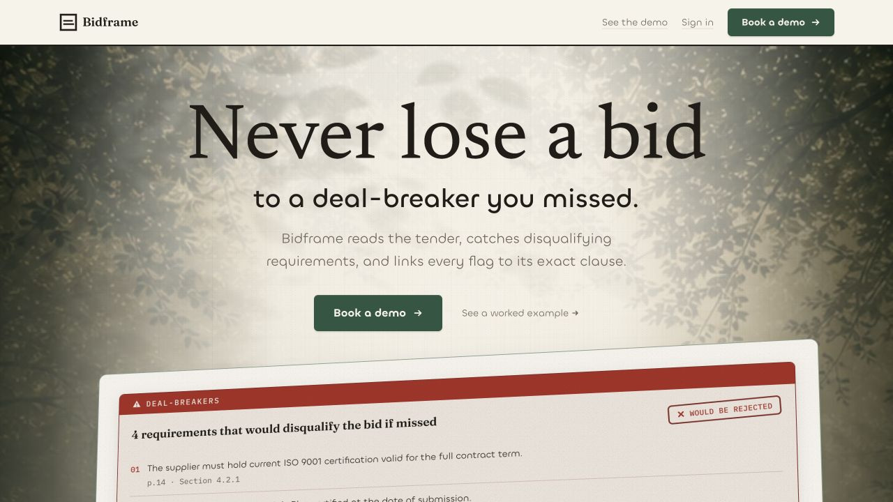
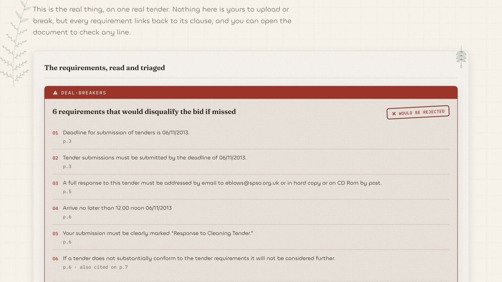
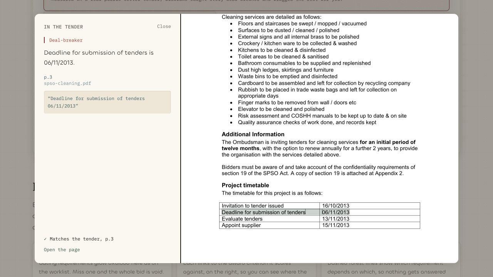
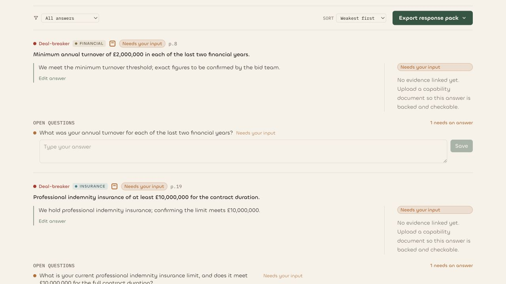
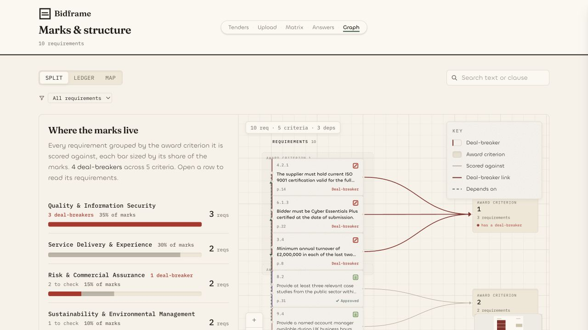
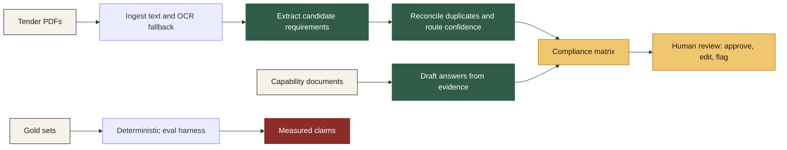

<p align="center">
  <a href="https://www.bidframe.org/showcase">
    
  </a>
</p>

<p align="center">
  <a href="https://www.bidframe.org/showcase"></a>
  
  
  
  
</p>

<p align="center">
  <strong>Bidframe turns a public-sector tender into a checkable compliance matrix.</strong><br />
  Deal-breakers first. Every line tied to its source. Draft answers only where there is evidence.
</p>

<p align="center">
  <a href="https://www.bidframe.org/showcase"><strong>Open the worked example</strong></a>
  |
  <a href="https://www.bidframe.org/demo">guided demo</a>
  |
  <a href="https://www.bidframe.org/pitch">pitch deck</a>
  |
  <a href="https://www.bidframe.org/codemap.html">code map</a>
</p>



## Judges: Start Here

If you have one minute, open **[`/showcase`](https://www.bidframe.org/showcase)**. It is the real product surface, frozen on a pre-baked Bradwell grounds-maintenance tender so it works without login, backend, or API key.

What you will see:

| In the worked example | What it proves |
|---|---|
| **50 requirements found** | Bidframe reads the tender into a reviewable register. |
| **12 deal-breakers flagged** | Pass/fail rules are lifted out before the bid team writes a word. |
| **4 answers drafted from evidence** | Drafts are built from capability documents, not invented. |
| **1 open question left for the user** | When evidence is missing, it asks instead of guessing. |
| **Every row links back to page and clause** | The bid manager can check the source before approving. |

For the full story:

| Route | Use it for |
|---|---|
| [`/showcase`](https://www.bidframe.org/showcase) | The interactive judge walkthrough. Same matrix as the live tool, seeded with a real tender run. |
| [`/pack`](https://www.bidframe.org/pack) | A **mixed tender pack** — a PDF ITT + a Word return-forms doc + an Excel pricing schedule + a CSV, all in one matrix, deal-breakers caught across every format. |
| [`/demo`](https://www.bidframe.org/demo) | A guided scroll-through for the product story. |
| [`/pitch`](https://www.bidframe.org/pitch) | The five-minute stage deck. |
| [`/review`](https://www.bidframe.org/review) | The live compliance matrix route. Demo-safe unless a backend URL is configured. |
| [`/answers`](https://www.bidframe.org/answers) | Draft answers, evidence receipts, and open questions. |
| [`/graph`](https://www.bidframe.org/graph) | Requirement relationships and where the marks live. |

## The Product

Public-sector tenders are full of pass/fail rules: insurance limits, submission instructions, pricing declarations, exclusion clauses, and award criteria. Missing one can waste days of bid work.

Bidframe does the first read:

1. **Reads the whole tender pack** — not just a PDF. A real pack is a PDF ITT plus Word return forms, an Excel pricing schedule, a CSV checklist, often zipped; Bidframe ingests **PDF, Word, Excel, CSV and ZIP** into one matrix, so a deal-breaker buried in a spreadsheet is caught the same as one in the PDF.
2. **Finds requirements** and keeps the exact source — page and clause for a PDF, sheet and row for a spreadsheet.
3. **Flags deal-breakers** so the bid team reviews bid-killers first — a two-stage engine (a deterministic net + a model pass) that never silently drops a gate.
4. **Drafts answers from the bidder's own evidence** where it can cite a capability document.
5. **Raises open questions** where evidence is missing.
6. **Keeps the bid manager in control** with approve, edit, and flag decisions on every line.

The AI reads and drafts. It never decides, approves, or submits.

## Built for teams

A tender is reviewed by a team — bid, compliance, and commercial. In the live product you can **share a
tender with a colleague or a standing team** and work it together **in real time**: when one reviewer
approves, edits, flags, or comments on a requirement, it appears on the others' screens **live, no refresh**
(streamed over Server-Sent Events). Every decision is **attributed to who made it** — stamped server-side, so
it can't be forged — a shared **activity feed** shows the team's actions as they happen, each row carries the
initials of whoever signed it off, and any requirement can hold a **comment thread** for the back-and-forth.
Reusable **teams** mean you set your bid group up once instead of re-inviting per tender. The audit trail
*is* the collaboration.

Two people on one tender, live: [`ops/demo-bob-script.md`](ops/demo-bob-script.md) walks the two-account
flow end to end.

## Why It Fits The Track

Conduct's Make Legacy Move thesis is not "replace the expert." It is "make the expert faster while their judgement stays in the work."

Bidframe captures the bid manager's review as structured context:

| Human action | Context Bidframe keeps |
|---|---|
| Approve a requirement | This clause is acceptable for this bidder. |
| Edit a draft answer | The bidder's preferred wording and evidence trail. |
| Flag a row | A risk, dependency, or colleague follow-up. |
| Answer a gap | New reusable knowledge for future bids. |

The matrix is the surface. The captured decisions are the compounding layer.

## Product Screens

| Deal-breakers first | Source proof beside the tender |
|---|---|
|  |  |

| Drafts with receipts | Requirement structure |
|---|---|
|  |  |

## How It Works



Core pieces:

| Area | What lives there |
|---|---|
| [`frontend/`](frontend) | Next.js 16, React 19, Tailwind. Compliance matrix, source panel, answer workspace, graph, showcase, pitch. |
| [`backend/`](backend) | FastAPI. Uploads, PDF ingest, extraction jobs, auth, persistence, REST API. |
| [`engine/`](engine) | Reconcile, dedupe, eval harness, deal-breaker safety net, answer drafting, groundedness checks. |
| [`prompts/`](prompts) | Extraction, classification, answer, and gap-interview prompt specs. |
| [`gold-set/`](gold-set) | Hand-labelled tenders used for reproducible measurement. |

The whole repo map is generated at [`CODEMAP.md`](CODEMAP.md), with an interactive version at [`/codemap.html`](https://www.bidframe.org/codemap.html).

## Proof We Can Defend

Bidframe is built around the risk that matters most: **do not miss a deal-breaker**. So the engine is **two-stage, not a prompt wrapper**: a deterministic disqualifier net (a regex over pass/fail language — *no model*) sets a recall floor, then the model pass removes false flags. The floor is what makes the guarantee reproducible.

**Reproduce the deal-breaker floor in seconds — no API key, no PDFs:**

```bash
python -m engine.scripts.net_floor
```

| Validated gold tender | Deterministic net catches |
|---|---:|
| SPSO Cleaning ITT | 2 / 2 |
| MAC Museum Cleaning ITT | 10 / 10 |
| Bradwell Grounds ITT *(held-out)* | 10 / 10 |
| Duffield Grounds ITT *(held-out)* | 4 / 4 |
| **Total** | **26 / 26** |

Every hand-labelled disqualifier across four validated tenders — two of them held out — flagged by the net with no model. (The in-progress WLWA gold set is excluded, same as `eval_all`.)

What we can safely say:

- The deal-breaker safety net is deterministic and tested against real gold sets and held-out tenders.
- The answer drafting path is evidence-first: if there is no citation, the product asks a question.
- The eval harness is deterministic. It does not use an LLM as the judge.
- Broader all-requirement recall is still small-sample, so we do not headline a single overall accuracy percentage.

More checks:

```bash
# Deal-breaker safety and trust invariants
python -m pytest engine/tests/test_adversarial_safety.py

# Aggregate extraction evaluation across labelled tenders
python -m engine.scripts.eval_all

# End-to-end deal-breaker recall with the safety net (needs OPENAI_API_KEY for embeddings)
python -m engine.scripts.gating_recall
```

Note: `net_floor` is the deterministic guarantee under the model; `eval_all` scores the raw extraction path. The safety net is measured separately because it is deliberately a second layer.

## Run It Locally

The fastest local path is the frontend. It uses frozen demo data by default, so no backend or key is needed.

```bash
cd frontend
npm install
npm run dev
```

Open `http://localhost:3000/showcase`.

To run the backend pipeline:

```bash
cd backend
python -m venv .venv
source .venv/bin/activate
pip install -r requirements.txt
uvicorn app.main:app --reload
```

Optional: add `OPENAI_API_KEY` in `backend/.env` for the OpenAI extractor. Without a key, the heuristic path still runs for plumbing and local development.

To connect the frontend to the backend:

```bash
cd frontend
NEXT_PUBLIC_API_BASE_URL=http://localhost:8000 npm run dev
```

## API Surface

| Method | Path | Purpose |
|---|---|---|
| `GET` | `/health` | Health check and active extractor. |
| `GET` | `/tenders` | List tenders the signed-in user owns **or has been shared into**. |
| `POST` | `/tenders/upload` | Upload a tender pack — PDF, Word, Excel, CSV, or a ZIP of them — and start extraction. |
| `GET` | `/tenders/{id}/requirements` | Return the tender in the locked requirement schema. |
| `POST` | `/tenders/{id}/draft` | Draft evidence-backed answers from uploaded capability documents. |
| `POST` | `/tenders/{id}/share` | Share a tender with another account by email (owner-only). |
| `GET` | `/tenders/{id}/members` | List everyone with access to a tender. |
| `POST` | `/tenders/{id}/team` | Share a tender with a whole team. |
| `GET` `POST` | `/teams` | List or create reusable teams; `POST /teams/{id}/members` adds people. |
| `GET` `POST` | `/requirements/{id}/comments` | Read or post a comment on a requirement. |
| `GET` | `/tenders/{id}/events` | Live SSE stream of decisions, comments, and members. |
| `PATCH` | `/requirements/{id}` | Save an approve / edit / flag decision — attributed server-side to the signed-in user. |

Full backend details are in [`backend/README.md`](backend/README.md).

## Data Contract

Every requirement follows the locked schema in [`AGENTS.md`](AGENTS.md): text, source page, source clause, source excerpt, type, gating flag, category, confidence, status, decision, answer, evidence refs, and open questions.

The frontend builds against the same shape as the backend returns. That is why `/showcase` can use a frozen real tender run and the live product can swap to the API without changing the UI.

## Team Notes

This is a seven-day Conduct hackathon build by a four-person team:

| Role | Owns |
|---|---|
| Jawad Jalal | Compliance matrix, source panel, answer workspace, graph, demo, visual system. |
| Pranav Bonagiri | PDF ingest, chunking, extraction, auth, persistence, REST API. |
| Bobby Choi | Reconcile, dedupe, eval harness, answer drafting, safety tests. |
| Joel Jeon | Prompts, orchestration, narrative, pitch, traction, glue. |

Working docs:

- [`START-HERE.md`](START-HERE.md) for orientation.
- [`STATUS.md`](STATUS.md) for live project state.
- [`comms/`](comms) for the agent message boards.
- [`frontend/copywriting.md`](frontend/copywriting.md) for the product voice.
- [`demo-claim-ledger.md`](demo-claim-ledger.md) for pitch claims and safe wording.

Built for Conduct "Make Legacy Move", 2026.
