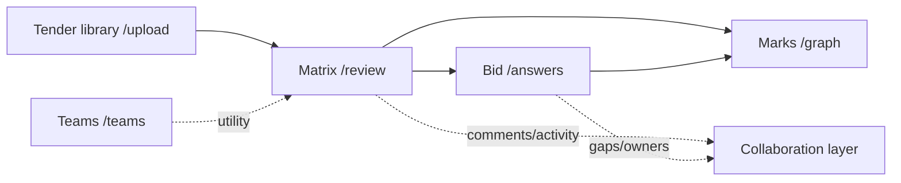

# Bidframe App UX Overhaul Brief

Local planning draft. Created 2026-07-05. Do not treat this as a commit-ready
spec until the team reviews it.

This brief is for the multipage app, not the old `/showcase` presenter surface.
The app is the product a client will use on a video call and, later, on their own
tender. The goal is not more visual polish in isolation. The goal is to make a
bid manager feel: "I know where I am, I know what Bidframe found, I know what I
have to do next, and I trust the team record this leaves behind."

## Skills Applied

- `ui-ux-pro-max`: used for accessibility, interaction, loading, navigation,
  and dense B2B workflow checks. The generic design-system output suggested a
  social-proof SaaS direction, but Bidframe already has a stronger local system:
  forest-led Civic Record. We keep the local system and borrow only the useful
  workflow rules.
- `design-rationale`: used to record major UX decisions, options, trade-offs,
  and validation plans.
- `information-architecture`: used to reorganise the app around task structure
  rather than routes.
- `navigation-patterns`: used to separate global navigation, tender-local
  navigation, and utilities.
- `heuristic-evaluation`: used to identify severity-ranked usability issues.
- `opportunity-framework`: used to convert the overhaul into independently
  shippable stages by impact, effort, dependency, and user value.

## Product Thesis

Bidframe is no longer just a demo matrix. It is a collaborative tender workspace:

1. Add or reopen a tender pack.
2. Review extracted requirements and clear deal-breakers.
3. Draft the bid response from evidence and answer gaps.
4. Use marks and structure to prioritise effort.
5. Share decisions, comments, and ownership across the team.

The current app contains most of these parts, but they still read as separate
pages. The UX overhaul should make them feel like one persistent tender record.

Design-language note:

The forest-led Civic Record system should affect the user's confidence,
emotional read, and sense of product continuity. It should not distort the UX
model. The workflow remains tender-first: upload/reopen a tender, review the
matrix, draft the bid, inspect marks, and collaborate around decisions.

Implementation note:

This UX overhaul can ship before the UI improvement plan. The first pass should
change structure, labels, workflow states, source-proof access, collaboration
placement, and next-action logic. Keep visual changes minimal in that pass. The
forest-led UI treatment belongs in the follow-up UI pass once the updated design
guidelines are stable.

## Five-Principle Product Gate

Adopt the five-principle filter as a decision tool, not as a slogan. Run it
before adding, keeping, or removing any UX requirement.

1. **Question every requirement.** What user risk does this solve? For
   Bidframe, valid answers are usually faster review, stronger source trust,
   clearer collaboration, safer export, or better tender orientation.
2. **Delete before redesign.** Remove duplicate controls, vague labels,
   decorative steps, dead states, and workflows that do not help a bid manager
   move from tender pack to reviewed response.
3. **Simplify the path.** Prefer fewer routes, fewer mystery states, one primary
   action per screen, and consistent labels: `Tender`, `Matrix`, `Bid`,
   `Marks`, `Show source`, `Share tender`.
4. **Accelerate user progress.** Reduce time to first deal-breaker, first source
   proof, first decision, first teammate action, first answered gap, and export
   readiness.
5. **Automate last.** Automate only after the manual workflow is understood.
   Good automation candidates are source proof, gap routing, evidence matching,
   export readiness, and teammate prompts. Do not automate away human review
   where trust or liability still depends on a person.

Guardrail:

Do not use "delete" as an excuse to remove trust-critical complexity. Source
proof, exact/approx match, audit trail, collaboration attribution, export
blockers, accessibility, and reduced-motion support are not bloat. They are the
product promise.

## Measurement And QA Summary

Use [QA.md](QA.md) to measure whether the UX overhaul actually worked.
Use [delete.md](delete.md) as the deletion backlog before adding more workflow
surface area.

Primary UX success signals:

- Time to first source proof decreases.
- Time to first meaningful decision decreases.
- Users can explain export blockers without help.
- Users can share a tender and see teammate activity in context.
- Users can identify bid readiness, evidence-backed answers, and gaps.
- Users can move from landing to `/demo` to app without losing the product
  model.

Each UX stage should end with a small QA pass:

- Route-specific task check.
- Greyscale state-recognition check where status is involved.
- Keyboard/focus check where overlays, comments, or dialogs are touched.
- Reduced-motion check when motion is introduced.
- Short stage sign-off from [QA.md](QA.md).

## Current App Map

| Area | Route | Main files | Current role |
|---|---|---|---|
| Tender library | `/upload` | `src/app/upload/page.tsx`, `src/components/UploadDropzone.tsx`, `src/components/TendersList.tsx`, `src/components/ProcessingView.tsx` | Upload a pack, watch extraction, reopen tenders |
| Matrix | `/review` | `src/app/review/page.tsx`, `src/components/MatrixView.tsx`, `src/components/ComplianceMatrix.tsx`, `src/components/RequirementPanel.tsx` | Review requirements, verify source, approve/edit/flag |
| Bid response | `/answers` | `src/app/answers/page.tsx`, `src/components/AnswersBody.tsx`, `src/components/ReadinessLedger.tsx`, `src/components/GapInterview.tsx` | Draft answers, upload evidence, resolve open questions, export |
| Structure | `/graph` | `src/app/graph/page.tsx`, `src/components/StructureView.tsx`, `src/components/GraphView.tsx`, `src/components/MarksView.tsx` | See where marks live and how requirements connect |
| Teams | `/teams` | `src/app/teams/page.tsx`, `src/components/TeamsManager.tsx` | Create teams and manage teammates |
| Collaboration controls | In tender workspace | `src/components/ShareControl.tsx`, `src/components/ActivityFeed.tsx`, `src/components/CommentThread.tsx`, `src/lib/collaborators.ts` | Share tender, show people/actions, comment on requirements |
| Shared shell | All app pages | `src/components/SiteHeader.tsx`, `src/components/SectionNav.tsx`, `src/components/DocumentHeader.tsx`, `src/components/AppMain.tsx` | App masthead, section nav, page title, tender reference |

## Overhaul Principle

Make the loaded tender the primary object. Pages are views of that tender, not
separate destinations.

The design layer can make that object feel more guided and memorable, but the
UX object is still the tender workspace, not the forest motif and not the visual
record style.

Today, the route structure is correct enough, but the mental model can be
stronger:

- `Tender` should answer: what tender am I working on, and what files did I give
  Bidframe?
- `Matrix` should answer: what has to be reviewed before we trust the tender?
- `Bid` should answer: what can go into the response, and what still needs a
  human?
- `Marks` should answer: where should the team spend effort?
- `People` should answer: who is in this tender record, and who did what?

## Recommended IA

Keep the routes, but adjust labels and hierarchy.

### Global Nav

Current:

- `SectionNav.tsx`: Tender, Bid, Matrix, Graph.
- `DocumentHeader.tsx`: Matrix, Bid, Graph local view switcher.

Recommended:

- Global app nav: `Tender`, `Matrix`, `Bid`, `Marks`.
- Utility nav: account menu, teams, sign out, help.
- Tender-local header: current tender title, source-pack summary, review status,
  people/share, and one primary next action.

Change `Graph` to `Marks` or `Marks & structure` in visible app navigation. The
current page title is already `Marks & structure`, and that is much closer to the
buyer's mental model than `Graph`.

### Route Model

### Navigation Rule

The top navigation should not look like a website nav once the user is inside a
tender. It should feel like a tender workspace:

- Tender name always visible.
- Source pack always visible or one click away.
- Team presence/share always visible.
- Current view active state obvious by more than colour.
- "Next" should say what it will do, not only say `Next`.

## Staged Rollout Plan

The UX overhaul should ship in stages. Each stage must leave Bidframe in a
better complete state, even if the next stage is delayed. Do not split by
component ownership alone. Split by user capability.

Stage rules:

- Each stage has one clear user promise.
- Each stage can be demoed on its own.
- Each stage must not create dead controls, placeholder flows, or "coming next"
  dependencies for ordinary use.
- Each stage should use existing visual language and tokens. The forest-led UI
  treatment is Stage 7, after the UX structure is stable.
- A stage may prepare data hooks for a later stage, but the visible UI must not
  expose unfinished behaviour.

### Stage 1: Workspace Orientation

Promise:

The user always knows which tender they are in, where they are in the workflow,
and what the next useful action is.

Why this comes first:

Every other improvement depends on orientation. If the user is unsure whether
they are viewing a sample, an old tender, or the current tender, source proof,
collaboration, bid drafting, and marks all feel weaker.

Primary scope:

- Rename visible navigation to the user's task language:
  - `Tender`
  - `Matrix`
  - `Bid`
  - `Marks`
- Keep route paths stable for now (`/upload`, `/review`, `/answers`, `/graph`)
  unless a later routing pass is deliberately scoped.
- Create the first version of the Tender Workspace Header using existing
  `DocumentHeader`, `SectionNav`, `ShareControl`, and compact `ControlPanel`
  concepts.
- Show the current tender title, tender id, source-pack count, review status,
  and one contextual next action.
- Replace generic `Next` copy with task-specific copy:
  - `Review next deal-breaker`
  - `Answer next gap`
  - `Approve next draft`
  - `Export`
- Make `/upload` read as `Tender library`, with a clear current tender strip
  when one exists.
- Upgrade `NoTenderLoaded.tsx` so each empty page gives a meaningful recovery:
  `Pick a tender`, `Upload a tender`, and recent tenders when available.

Out of scope:

- Do not redesign the visual system.
- Do not rebuild the matrix row model.
- Do not add new collaboration permissions.
- Do not change the schema.

Likely files:

- `src/components/DocumentHeader.tsx`
- `src/components/SectionNav.tsx`
- `src/components/SiteHeader.tsx`
- `src/components/ControlPanel.tsx`
- `src/components/ShareControl.tsx`
- `src/components/NoTenderLoaded.tsx`
- `src/components/TendersList.tsx`
- `src/components/UploadDropzone.tsx`
- `src/context/RequirementsContext.tsx`

Definition of done:

- On `/upload`, `/review`, `/answers`, and `/graph`, a user can identify the
  current tender without opening another panel.
- The active view is obvious without relying on colour.
- Every empty state has a real next action.
- Navigation copy is consistent across `SectionNav` and `DocumentHeader`.
- The app is still fully usable if the rollout stops here.

Acceptance test:

Give a user a loaded tender and ask: "What tender is this, where are you, and
what should you do next?" They should answer correctly in under five seconds.

### Stage 2: Matrix Review Flow

Promise:

The user can review requirements confidently, starting with the items most
likely to affect bid/no-bid risk.

Why this stage matters:

The matrix is still the product's trust anchor. It is where the user decides
whether Bidframe found the right work. This stage should make `/review` feel
like a command centre without waiting for bid drafting or marks improvements.

Primary scope:

- Strengthen review grouping around the work to be done:
  - deal-breakers to clear
  - needs input
  - worth a second look
  - ready to approve
  - approved/decided
- Keep confidence as a dot/bar plus word, never a raw number.
- Make gating requirements heavier in hierarchy and interaction:
  - no one-click approval for gating rows
  - panel-first review for deal-breakers
  - explicit confirmation copy for approval
- Make row-to-panel flow faster:
  - preserve selected row
  - move to next unresolved item
  - keep index context when the panel is open
- Clarify decision actions:
  - `Approve`
  - `Edit`
  - `Flag`
  - `Comment`
  - `Show source`
- Keep bulk approval scoped and honest:
  - only confident, non-gating drafts
  - copy names exactly what will be touched
  - confirmation and undo/recovery path if implemented

Out of scope:

- Do not require the Bid page to be redesigned.
- Do not build requirement assignment yet unless it already exists cleanly.
- Do not restyle the full matrix into the forest-led UI pass.

Likely files:

- `src/components/MatrixView.tsx`
- `src/components/ComplianceMatrix.tsx`
- `src/components/RequirementPanel.tsx`
- `src/components/GatingHero.tsx`
- `src/components/ControlPanel.tsx`
- `src/components/BulkActionBar.tsx`
- `src/lib/triage.ts`
- `src/lib/matrix-derive.ts`

Definition of done:

- Deal-breakers are visible before reading row text.
- A user can process one item, move to the next, and keep their place.
- Approval, edit, flag, and needs-input states are distinct in copy and
  behaviour.
- Stopping after this stage still leaves the app better for a solo bid manager.

Acceptance test:

Ask a user to find the first bid-risk item, inspect it, decide it, and move to
the next item. They should not need coaching.

### Stage 3: Source Proof Loop

Promise:

Anywhere the user sees a requirement or answer, they know how to prove where it
came from.

Why this stage matters:

Traceability is the reason Bidframe can be trusted. This stage makes the proof
loop consistent across PDF, Word, Excel, CSV, matrix, answers, and marks without
requiring the full collaboration or bid workflow to be finished.

Primary scope:

- Standardise the proof action as `Show source`.
- Use the same proof pattern in:
  - matrix rows and selected row state
  - `RequirementPanel`
  - answer cards
  - marks/detail drawer
  - source overlays
- Preserve context when proof opens and closes:
  - return focus to the triggering row/button
  - keep selected requirement active
  - do not eject the user to another route
- Make source match quality honest:
  - exact match
  - approximate match
  - extracted text only
  - unavailable source
- Keep format differences inside the proof surface. Users should not need
  different proof verbs for PDF versus Office-derived rows.
- Ensure source proof works for non-PDF files without implying fake PDF
  highlights.

Out of scope:

- Do not build a full Office editor.
- Do not add new extraction features.
- Do not redesign the source overlay visually beyond clarity and consistency.

Likely files:

- `src/components/SourceVerifyOverlay.tsx`
- `src/components/PdfSourceView.tsx`
- `src/components/DocxSourceView.tsx`
- `src/components/SheetSourceView.tsx`
- `src/components/RequirementPanel.tsx`
- `src/components/ComplianceMatrix.tsx`
- `src/components/AnswerCard.tsx`
- `src/components/StructureView.tsx`
- `src/lib/source-doc.ts`

Definition of done:

- A user can verify a PDF row and an Excel/CSV/Word row with the same learned
  interaction.
- Exact and approximate matches are labelled honestly.
- Keyboard users can open proof, close it, and continue from the same item.
- If the rollout stops here, Bidframe's trust story is materially stronger.

Acceptance test:

Ask users: "Show me where this came from." They should find `Show source`
without hunting, then return to the same work item.

### Stage 4: Collaboration At The Work Item

Promise:

The user can see who is involved, who did what, and where discussion belongs
without leaving the requirement or answer they are working on.

Why this stage matters:

Collaboration is now a real differentiator. It should not live only on `/teams`
or in a detached feed. This stage makes teamwork visible at the decision point,
while still leaving advanced permissions and presence for later.

Primary scope:

- Bring compact people/share/activity into the workspace header.
- Add row/card-level collaboration markers:
  - comment count
  - latest actor
  - assigned/owner marker if supported
  - unresolved comment marker
- Make `CommentThread` feel tied to a requirement, answer, gap, or source
  excerpt, not like generic chat.
- Give `ActivityFeed` a clear product role:
  - tender-level history
  - newest-first
  - actor, action, object, time
  - filters if cheap
- Make sharing visible but not noisy:
  - `Share tender`
  - people with access
  - invite state
  - link back to `/teams` for management
- Write plain-language permission feedback:
  - `Only owners can invite teammates`
  - `You can comment, but not approve`
  - `This tender is shared with your team`

Edge cases to design now:

- **Invite pending, failed, expired, or already accepted:** never leave the user
  wondering whether sharing worked. Show a clear state and one recovery action.
- **Access changes mid-session:** if a user loses approval or invite permission,
  keep their current text/comment intact, explain what changed, and offer a safe
  next step.
- **Simultaneous decisions:** if Alice approves while Bob rejects or edits the
  same item, do not silently overwrite. Show the latest saved decision, who made
  it, and whether the current user needs to refresh, compare, or re-apply.
- **Offline or reconnecting collaboration:** keep local reading/review possible,
  but label comments, approvals, and invites as unsynced until confirmed.
- **Unknown, removed, or deactivated actors:** keep the audit line intact with a
  neutral label such as `Former teammate`, never delete attribution.
- **Long names and many collaborators:** collapse people into a count and tooltip
  or popover before the header wraps or pushes out the primary action.
- **Unresolved comments before export:** distinguish FYI comments from blockers.
  Block only when a comment is marked as blocking approval, answer completion, or
  export readiness.

Out of scope:

- Full realtime presence can wait.
- Role-based permission redesign can wait.
- Notification centre can wait.
- Do not block core matrix review on collaboration being configured.

Likely files:

- `src/components/ShareControl.tsx`
- `src/components/ActivityFeed.tsx`
- `src/components/CommentThread.tsx`
- `src/components/TeamsManager.tsx`
- `src/components/ComplianceMatrix.tsx`
- `src/components/RequirementPanel.tsx`
- `src/components/AnswerCard.tsx`
- `src/lib/collaborators.ts`

Definition of done:

- A user can tell whether a requirement has comments or teammate activity from
  the work surface.
- A user can invite/share from the workspace header or nearby surface.
- A comment is clearly attached to a work item.
- Collaboration failure and conflict states preserve user input and attribution.
- If stopped here, collaboration feels real for client demos and team usage.

Acceptance test:

Run a two-account scenario. Alice shares a tender, Bob comments or decides an
item, and Alice can see that action in the relevant work surface without going
to `/teams`. Then force one edge case: failed invite, access removed, reconnect,
or conflicting decision. The UI must explain what happened and preserve the
record.

### Stage 5: Bid Response Workflow

Promise:

The user can move from reviewed requirements to a response worklist, answer
gaps, upload evidence, and understand whether export is blocked.

Why this stage matters:

This is the product expansion from "requirements found" to "response being
completed." It should ship after orientation, matrix review, proof, and
collaboration are understandable, because it depends on those trust loops.

Primary scope:

- Make `/answers` feel like a production workflow, not a duplicate matrix.
- Lead with readiness:
  - needs input
  - to verify
  - ready to approve
  - blocked export
- Separate the major work modes:
  - evidence intake
  - drafted answers
  - gap questions
  - answer review
  - export
- Make answer states obvious:
  - auto draft
  - needs input
  - human edited
  - empty
  - approved
  - flagged
- Clarify evidence upload:
  - capability docs
  - which answers are backed
  - which gaps remain unbacked
- Make export honest:
  - show blockers
  - allow preview/export only when appropriate
  - never imply the bid is complete without human approval
- Treat export as three artifact types:
  - `Compliance Matrix`: internal tracking, XLSX first, CSV fallback
  - `Bid Response Draft`: editable response draft, DOCX first
  - `Audit/Evidence Pack`: internal proof trail, PDF or DOCX appendix
- Keep client-ready output clean and internal-review output detailed.
- Show unresolved gaps as explicit prompts, never as hidden omissions.

Out of scope:

- Do not build a document editor.
- Do not create a proposal-writing wizard.
- Do not build a polished buyer-submission generator in this stage.

Likely files:

- `src/components/AnswersBody.tsx`
- `src/components/ReadinessLedger.tsx`
- `src/components/GapInterview.tsx`
- `src/components/CapabilityUpload.tsx`
- `src/components/EvidenceLibrary.tsx`
- `src/components/AnswerWorkspace.tsx`
- `src/components/AnswerCard.tsx`
- `src/components/AnswerFilterBar.tsx`
- `src/components/ExportMenu.tsx`
- `src/components/AutofillButton.tsx`

Definition of done:

- A user understands whether they should upload evidence, answer gaps, review
  drafts, or export.
- Export blockers are clear and actionable.
- Export artifact choices are clear: matrix, response draft, audit/evidence
  pack, and optionally all files.
- Exported artifacts do not hide uncertainty, unresolved gaps, or missing
  evidence.
- Source proof and collaboration patterns from earlier stages carry through.
- If stopped here, Bidframe can support a credible review-to-response workflow.

Acceptance test:

Ask a user to find what blocks export, answer one gap, verify one drafted answer
against evidence, and attempt export. The UI should explain each state.

### Stage 6: Marks And Strategy

Promise:

The user can understand where marks live, which requirements affect scoring,
and where the team should spend effort.

Why this stage comes after core review and bid workflow:

Marks are valuable, but they are strategy. They should not block the core tender
review or response workflow. This stage makes `/graph` useful to bid managers
without turning it into decorative complexity.

Primary scope:

- Rename visible navigation to `Marks`; use `Marks & structure` as the page
  title when there is room.
- Make the page answer three questions:
  - which criteria carry the most weight?
  - which requirements affect those criteria?
  - which deal-breakers or dependencies change priority?
- Use clear modes:
  - `Split`
  - `Ledger`
  - `Map`
- Share selection state between `MarksView` and `GraphView`.
- Keep details in a drawer instead of ejecting users to `/review` by default.
- Add actions that bridge work:
  - `Show source`
  - `Open in matrix`
  - `Open answer`
  - `Show related requirements`
- Keep the map purposeful:
  - highlight selected requirement
  - highlight criterion
  - highlight dependencies
  - dim unrelated nodes

Out of scope:

- Do not build a complex planning board.
- Do not add manual scoring configuration unless already supported by data.
- Do not make the map the primary navigation mechanism.

Likely files:

- `src/components/StructureView.tsx`
- `src/components/MarksView.tsx`
- `src/components/GraphView.tsx`
- `src/components/RequirementDrawer.tsx`
- `src/lib/structure.ts`
- `src/components/DocumentHeader.tsx`
- `src/components/SectionNav.tsx`

Definition of done:

- A non-technical bid manager understands why the page exists.
- The user can move from marks to source, matrix, or answer without losing
  context.
- The map supports decision-making rather than visual novelty.
- If stopped here, Bidframe has a useful strategy surface layered on top of the
  review workflow.

Acceptance test:

Ask a user where they would go to find which requirements affect the most
points. They should choose `Marks`, identify a criterion, inspect related
requirements, and jump back to matrix or answer context.

### Stage 7: UI Improvement And Forest-Led Continuity

Promise:

The already-improved UX feels more ownable, solid, memorable, and continuous
from landing to demo to app.

Why this comes last:

The visual system should amplify a stable workflow, not compensate for an
unclear one. Stage 7 is where the app moves further into the forest-led civic
record style without changing the UX structure created in Stages 1 to 6.

Primary scope:

- Follow the full [UI-IMPROVEMENT-PLAN.md](UI-IMPROVEMENT-PLAN.md).
- Bring forest-led treatment into:
  - workspace header guidance
  - primary calls to action
  - upload and processing
  - collaboration presence
  - demo/product continuity
  - selected arrival moments
- Keep record discipline in:
  - matrix review
  - requirement panel
  - source proof
  - evidence blocks
  - approval trail
  - marks and export readiness
- Tighten visual hierarchy, focus states, motion, and state treatment after the
  UX stages have proven their shape.

Out of scope:

- Do not reopen IA unless usability testing proves the UX stages are wrong.
- Do not restyle every surface for the sake of visual consistency.
- Do not let forest become generic green decoration.

Likely files:

- See [UI-IMPROVEMENT-PLAN.md](UI-IMPROVEMENT-PLAN.md) for the full component
  plan, visual token plan, motion plan, accessibility criteria, and validation
  checklist.

Definition of done:

- The app feels like the same product as the landing and `/demo`.
- Forest leads guidance and customer feeling; record leads proof and decisions.
- The UI pass does not regress any Stage 1 to 6 workflow.
- If stopped here, the product feels polished without losing trust.

Acceptance test:

Run a five-minute client walkthrough from landing/demo into the multipage app.
The viewer should feel continuity, understand the work, and trust the proof
without needing the presenter to explain the design language.

### Stage Dependency Summary

| Stage | Depends on | Independent value if shipped alone |
|---|---|---|
| 1. Workspace Orientation | Existing app shell and tender context | Removes "where am I?" confusion across the app |
| 2. Matrix Review Flow | Stage 1 helps, but can partly ship alone | Makes requirement review safer and faster |
| 3. Source Proof Loop | Stage 1 or 2 for best placement | Strengthens trust everywhere proof appears |
| 4. Collaboration At The Work Item | Stage 1 for header placement, existing collab APIs | Makes teamwork visible and demoable |
| 5. Bid Response Workflow | Stages 1 to 3, Stage 4 for team signals | Turns review into response completion |
| 6. Marks And Strategy | Stages 1 to 3 | Adds a strategy surface without blocking review |
| 7. UI Improvement | Stable UX from Stages 1 to 6 | Makes the product feel more ownable and continuous |

## Primary UX Problems

### P0-1: The App Needs A Persistent Tender Workspace Header

Location:

- `src/components/SiteHeader.tsx`
- `src/components/SectionNav.tsx`
- `src/components/DocumentHeader.tsx`
- `src/components/ControlPanel.tsx`
- `src/components/ShareControl.tsx`

Problem:

The app has a masthead, a page title row, a section nav, and a separate control
panel. The information is good, but the mental model is split. A user needs one
stable place that says: this is the tender, this is where I am in the workflow,
these are the people, and this is the next action.

Recommendation:

Create a "Tender Workspace Header" pattern using existing pieces:

- Left: tender title, tender id, source pack count.
- Centre: workflow nav with status counts:
  - `Tender`
  - `Matrix` with unresolved count.
  - `Bid` with gap count.
  - `Marks` with high-mark/deal-breaker count.
- Right: `Share` button, people avatars, activity toggle, export/primary action.
- Underline/current state should use rule weight, label weight, and count badge,
  not colour alone.

Specific button/copy changes:

- `Next` in `DocumentHeader.tsx` should become specific:
  - `Review next deal-breaker`
  - `Answer next gap`
  - `Export`
- `Share` in `ShareControl.tsx` should live in the persistent header when a
  tender is loaded, not only as a separate block inside the matrix.
- Add a compact `Activity` button beside `Share`, opening `ActivityFeed`.

Rationale:

Clients will judge whether Bidframe feels like a product, not a collection of
screens. A persistent workspace header makes the app feel accountable and
continuous.

Trade-off:

This may move some information out of `ControlPanel`. That is good. The control
panel can become the expanded tender ledger, while the header carries the daily
working status.

Validation:

In a 5-minute client walkthrough, the viewer should be able to answer without
prompting: which tender is loaded, how many deal-breakers remain, who can access
it, and what the next recommended action is.

### P0-2: Tender Library Should Establish "Current Tender" Clearly

Location:

- `/upload`
- `src/components/UploadDropzone.tsx`
- `src/components/TendersList.tsx`
- `src/components/ProcessingView.tsx`
- `src/components/NoTenderLoaded.tsx`

Problem:

The tender library handles upload and reopening, but the rest of the app needs a
stronger "selected tender" model. If a user clicks into `Bid`, `Matrix`, or
`Marks`, they should never wonder whether they are seeing a sample, an old tender,
or the tender they just uploaded.

Recommendation:

Turn `/upload` into `Tender library` plus `Current tender`.

Specific changes:

- At the top of `/upload`, show a current tender strip when `tenderId` exists:
  - title
  - uploaded date
  - source docs count and formats
  - requirements/deal-breakers
  - buttons: `Open matrix`, `Draft bid`, `Share`
- In `TendersList.tsx`, group tenders:
  - `Current`
  - `Shared with me`
  - `Uploaded by me`
  - `Samples` only when no API is configured
- After upload completes in `UploadDropzone.tsx`, the success card should say
  `Open matrix` as the primary action, with secondary `Draft bid` and `Share`.
- In `ProcessingView.tsx`, keep the current per-file progress, but add an
  explicit line when the backend expands a ZIP: `ZIP expanded into N source
  documents`.
- `NoTenderLoaded.tsx` should offer `Pick a tender` plus recent tenders, not only
  `Upload a tender`.

Rationale:

The app's trust depends on continuity. The user must feel every page is reading
the same tender record.

Validation:

Task: "Open a tender you uploaded earlier and go straight to the unanswered
questions." Success means the user reaches `/answers` with the right tender in
under 30 seconds and never asks which data is loaded.

### P0-3: Matrix Should Be The Review Command Centre

Location:

- `/review`
- `src/components/MatrixView.tsx`
- `src/components/ComplianceMatrix.tsx`
- `src/components/GatingHero.tsx`
- `src/components/ControlPanel.tsx`
- `src/components/RequirementPanel.tsx`

Problem:

The matrix has strong components, but it can do more to guide the user's order of
operations. The key question is not "what rows exist?" It is "what must I clear
before the bid is safe?"

Recommendation:

Make `/review` start with a review plan:

1. Clear deal-breakers.
2. Check uncertain extraction.
3. Approve confident routine rows.
4. Move to Bid response.

Specific changes:

- `GatingHero.tsx`: keep as the alarm, but add a single CTA:
  - `Review first deal-breaker`
  - when cleared: `Deal-breakers cleared`
- `ControlPanel.tsx`: split into two modes:
  - collapsed header ledger in the workspace header
  - expanded `Tender record` panel below the matrix, with source docs, decisions,
    people, and activity
- `ComplianceMatrix.tsx`: add row-level collaboration signals:
  - comment count badge when `CommentThread` has comments
  - assignment/owner chip if added later
  - "updated by teammate" visual pulse for SSE decision changes
- `StatusWord` in `ComplianceMatrix.tsx`: keep attribution, but make `Flagged`
  include `by X` to match approved/edited wording.
- Group headers should show one action each:
  - deal-breakers: `Review all`
  - needs input: `Send to Bid`
  - ready: `Approve confident`
- Bulk selection should show why some selected rows cannot be bulk-approved:
  `3 selected, 1 deal-breaker must be opened first`.

Rationale:

Bid managers do not want a table. They want risk reduced in the right order.
The UI should turn the matrix into a worklist with explicit priority.

Validation:

Task: "Clear the first disqualifying requirement, verify where it came from, and
leave a decision trail." Success means the user opens the right row, sees the
source, approves/flags/edits, and can point to the audit line afterwards.

### P0-4: Source Proof Must Be One Recognisable Interaction Everywhere

Location:

- `src/components/SourceVerifyOverlay.tsx`
- `src/components/PdfSourceView.tsx`
- `src/components/DocxSourceView.tsx`
- `src/components/SheetSourceView.tsx`
- `src/components/RequirementPanel.tsx`
- `src/components/GraphView.tsx`
- `src/components/MarksView.tsx`

Problem:

Source proof is Bidframe's strongest trust loop. It exists, but the proof
affordance needs to be impossible to miss and consistent across PDF, Word, Excel,
and CSV.

Recommendation:

Use one visible action label everywhere:

- `Show source`

Then the overlay handles format:

- PDF: exact page highlight
- Word: paragraph highlight
- Excel/CSV: row/cell highlight
- Missing source: extracted text with honest warning

Specific changes:

- In `RequirementPanel.tsx`, add a primary `Show source` button near the
  requirement text, not only inside supporting proof surfaces.
- In `ComplianceMatrix.tsx`, expose a small source icon/text action on selected
  or focused rows. Avoid hover-only access.
- In `StructureView.tsx` drawer jumps, include `Show source` before `View in
  matrix` and `Draft answer`.
- In `SourceVerifyOverlay.tsx`, keep `Matches the tender` / `Close match` /
  `Shown from extracted text`, but make the match state visible near the
  document header as well as the claim side.
- Add format badges to the overlay header using `source-doc.ts` helpers.

Rationale:

"Every line traceable" is not a marketing claim. It is a repeated interaction.
The user should learn it once and recognise it everywhere.

Validation:

Task: "Check this Excel-derived pricing requirement against the source." Success
means the user opens the correct source without guessing that PDF proof is the
only supported mode.

### P0-5: Collaboration Needs To Become Visible At The Point Of Work

Location:

- `src/components/ShareControl.tsx`
- `src/components/ActivityFeed.tsx`
- `src/components/CommentThread.tsx`
- `src/components/TeamsManager.tsx`
- `src/components/RequirementPanel.tsx`
- `src/components/ComplianceMatrix.tsx`
- backend endpoints around `/tenders/{id}/share`, `/tenders/{id}/team`,
  `/tenders/{id}/activity`, `/tenders/{id}/events`, and comments

Problem:

Collaboration is real: teams, shared tenders, activity, comments, SSE, server
stamped actors. But much of the collaboration value is inside panels. A client
needs to see at a glance that this is a team review record, not a solo checklist.

Recommendation:

Make collaboration visible in three layers:

1. Workspace layer: people on the tender, share state, recent activity.
2. Row layer: who decided, comment count, teammate-updated state.
3. Detail layer: comments, decision audit, source proof, and optional owner.

Specific changes:

- `ShareControl.tsx`:
  - promote to workspace header when tender exists
  - keep dialog, but add tabs or sections:
    - `Invite by email`
    - `Share with team`
    - `People with access`
  - show owner/member limitation in plain copy
- `ActivityFeed.tsx`:
  - add filters: `All`, `Decisions`, `Comments`, `People`
  - let each activity item deep-link to its requirement
  - show "live" connection state if SSE is active
- `CommentThread.tsx`:
  - show comment count in `RequirementPanel` zone heading
  - add `@name` hint if teams are present
  - add "Resolve thread" later if comments become blocking decisions
- `ComplianceMatrix.tsx`:
  - existing `DecisionActorChip` is valuable; add a comment badge next to it
  - show "Bob updated this" transiently when SSE changes a row
- `TeamsManager.tsx`:
  - explain how a team affects tenders: `Add teammates here, then share any
    tender with this team from the tender header.`
  - add a link back to `/upload` or current tender after creating a team

Rationale:

The buyer value is not only extracting requirements. It is capturing the team's
judgement. Collaboration should be visible without making the user hunt for it.

Validation:

Task: "Share this tender with a teammate, ask them to check a pricing gate, and
see their action land." Success means the owner can share, comment, see the
teammate's update in the matrix, and inspect the activity log.

### P0-6: Bid Page Should Feel Like The Response Is Being Completed

Location:

- `/answers`
- `src/components/AnswersBody.tsx`
- `src/components/AutofillButton.tsx`
- `src/components/CapabilityUpload.tsx`
- `src/components/ReadinessLedger.tsx`
- `src/components/GapInterview.tsx`
- `src/components/AnswerWorkspace.tsx`
- `src/components/AnswerCard.tsx`
- `src/components/ExportMenu.tsx`

Problem:

The answer workflow has the right parts, but the page should more strongly
communicate a response-building sequence: evidence in, drafts out, gaps assigned,
export when ready.

Recommendation:

Restructure `/answers` into four zones:

1. `Evidence library`: what documents Bidframe can use.
2. `Draft run`: `Draft my answers` plus run status.
3. `Gaps`: open questions grouped by risk and owner.
4. `Response`: answer cards, weakest first by default, export when ready.

Specific changes:

- `AnswersBody.tsx`: replace the opening paragraph with a compact response
  status line:
  `N answers ready, M need input, K unbacked, D deal-breakers unresolved.`
- `AutofillButton.tsx`: if no capability docs are uploaded, button copy should
  guide:
  `Upload evidence to draft answers`
  or show a secondary `Draft from sample evidence` in demo mode only.
- `CapabilityUpload.tsx`: make uploaded capability docs feel persistent, with
  page count, evidence coverage, and remove/replace affordance if supported.
- `GapInterview.tsx`: add per-question collaboration:
  - `Assign to teammate` later
  - `Copy question`
  - `Mark answered by team`
- `ReadinessLedger.tsx`: keep progress bar, but add a primary action when gaps
  remain:
  - `Answer next gap`
  - when ready: `Export`
- `AnswerCard.tsx`: show the source requirement and answer evidence as two
  linked receipts. The user should see both sides: tender clause and capability
  evidence.

Rationale:

The bid page is the conversion payoff. It proves Bidframe is not just a
checklist: it turns a tender into a draftable, reviewable response while keeping
humans in control.

Validation:

Task: "Upload evidence, draft answers, answer one open question, and export."
Success means the user understands why a draft is or is not ready.

### P1-1: Marks Page Should Be Strategy, Not A Diagram

Location:

- `/graph`
- `src/components/StructureView.tsx`
- `src/components/MarksView.tsx`
- `src/components/GraphView.tsx`
- `src/components/RequirementDrawer.tsx`

Problem:

The visual graph is useful, but clients care about marks, criteria, and risk.
The page title already says `Marks & structure`; the UX should lean into that.

Recommendation:

Make the first state a marks ledger, with the map as a supporting view.

Specific changes:

- Rename visible nav from `Graph` to `Marks`.
- In `StructureView.tsx`, default to `split` on desktop, `ledger` on smaller
  screens, as it already does. Make the segmented control labels:
  - `Marks + map`
  - `Marks only`
  - `Map only`
- Add a top summary:
  - highest weighted criterion
  - deal-breakers inside each criterion
  - unanswered/gap count per criterion
- In `MarksView.tsx`, each criterion row should offer:
  - `Open first unresolved`
  - `Draft answers in this criterion`
  - `Show on map`
- In `GraphView.tsx`, ensure non-interactive decorative complexity is not the
  main path. The main work path should remain in the ledger/drawer.

Rationale:

Clients buy prioritisation, not graph novelty. The graph is valuable when it
answers "where do the marks live?"

Validation:

Task: "Find the criterion with the most marks and the unresolved deal-breaker
inside it." Success means the user finds it faster in `Marks` than in the matrix.

### P1-2: Empty States Should Preserve Momentum

Location:

- `src/components/NoTenderLoaded.tsx`
- `/answers`
- `/review`
- `/graph`
- `/teams`

Problem:

Empty states currently explain what to do, but they should also keep the user in
the workflow. In live mode, a user landing on `/answers` without a tender should
not hit a dead end.

Recommendation:

Create one richer `NoTenderLoaded` pattern:

- heading
- explanation
- primary action: `Pick a tender`
- secondary action: `Upload a tender pack`
- recent tenders list if available
- sample worked example only when no API is configured

Rationale:

Navigation errors happen. Good empty states recover them.

Validation:

Task: "You clicked Bid before choosing a tender. Continue with a recent tender."
Success means no backtracking or confusion.

### P1-3: Collaboration Permissions Need Plain-Language Feedback

Location:

- `ShareControl.tsx`
- `TeamsManager.tsx`
- API errors surfaced through `api.ts`

Problem:

The backend has correct guards: registered account required, owner-only share,
team owner limits, outsider walled. The UI should translate those rules into
plain recovery paths.

Recommendation:

Create canonical error copy:

- no account: `That email does not have a Bidframe account yet. Ask them to sign
  in first, then share again.`
- not owner: `Only the tender owner can share this tender.`
- removed access: `You no longer have access to this tender.`
- SSE disconnected: `Live updates paused. Refresh to reconnect.`

Rationale:

Collaboration failures are sensitive. They should never sound like system
errors when they are permission rules.

Validation:

Ask a non-owner to share and a removed member to reopen the tender. Both should
understand what happened without developer explanation.

## Heuristic Findings

| Severity | Heuristic | Location | Finding | Recommendation |
|---:|---|---|---|---|
| 4 | Visibility of system status | Whole app | The app can under-communicate which tender is active across routes. | Persistent workspace header with tender identity and counts. |
| 4 | Match real world | `/graph` nav label | `Graph` is internal; bid managers think in marks, criteria, and risk. | Rename visible label to `Marks` or `Marks & structure`. |
| 3 | Recognition over recall | `/answers`, `/review`, `/graph` empty states | Users must remember to go back to Tender first. | Rich empty states with recent tenders and "Pick a tender." |
| 3 | Visibility of system status | Collaboration | Real-time updates and team access exist but can be invisible. | People strip, activity button, row comment/actor badges, live indicator. |
| 3 | User control and freedom | Matrix bulk actions | Bulk approve is safe but needs clearer explanation when rows are excluded. | Bulk bar should state why deal-breakers cannot be approved in bulk. |
| 3 | Error recovery | Sharing and teams | Permission errors need human language. | Canonical collaboration error copy and recovery actions. |
| 2 | Consistency | Source proof | PDF, Office, matrix, graph, and panel proof affordances can feel different. | Standardise on `Show source`. |
| 2 | Aesthetic and minimalist design | `ControlPanel` | Valuable ledger content risks becoming visually heavy at the top of Matrix. | Collapse into workspace status, expand as tender record. |
| 2 | Flexibility and efficiency | Matrix and Bid | Keyboard shortcuts exist in Matrix, but not exposed contextually. | Add command palette hints in help/empty states, not persistent clutter. |

## Collaboration UX Model

Collaboration should answer five questions:

1. Who has access to this tender?
2. Who is currently working or recently active?
3. Who made this decision?
4. What was said about this requirement?
5. Can I trust the audit trail?

Current support:

- `ShareControl.tsx`: invite by email, share with team.
- `TeamsManager.tsx`: create teams and add/remove members.
- `ActivityFeed.tsx`: append-only decision feed, with derived fallback.
- `CommentThread.tsx`: requirement-level comments with SSE updates.
- `ComplianceMatrix.tsx`: decision actor chip and attributed status.
- `RequirementPanel.tsx`: team comments and audit line.

Overhaul additions:

- Workspace header people strip.
- Row comment count.
- Activity filter and deep-link.
- Live update connection state.
- Plain-language permission states.
- Optional next phase: assignment owner per gap/requirement.

Collaboration edge-case model:

- **Pending state:** invite sent, comment saving, decision saving, activity
  reconnecting. The user sees progress without losing context.
- **Conflict state:** another person changed the same item. The record shows
  actor, action, time, and a clear recovery path.
- **Permission state:** the user can view/comment/approve/invite only where their
  role allows it. Disabled controls explain the missing permission.
- **Attribution state:** removed users, unavailable users, and imported activity
  remain attributable without pretending the actor is still active.
- **Export state:** unresolved blocker comments and open assignments appear in
  readiness and export checks; non-blocking comments remain visible but do not
  stop work.

## Design Rationale

### Decision 1: Treat The Tender As The Workspace

Context:

Bidframe is used under deadline pressure. Users are not browsing features; they
are trying to get one tender under control.

Options considered:

- Keep current page-based app shell.
- Collapse everything into one large dashboard.
- Treat the tender as a persistent workspace across pages.

Decision:

Treat the tender as the persistent workspace. Keep pages as views.

Reasoning:

This preserves the existing Next.js route structure and component investment
while fixing the user's mental model. It also supports collaboration, because a
shared tender is the natural unit of team work.

Trade-offs:

The header becomes more complex. To avoid clutter, only the current tender,
workflow state, people, and primary next action should live there.

Validation:

Users can move from Matrix to Bid to Marks and correctly describe the same loaded
tender without asking whether the data changed.

### Decision 2: Make Collaboration Visible At The Work Surface

Context:

Collaboration has shipped technically, but hidden collaboration does not convert
clients. The value is visible when people, decisions, comments, and activity sit
next to the tender work.

Options considered:

- Keep collaboration in Teams page and Share dialog.
- Add a separate collaboration dashboard.
- Surface collaboration inside the tender workflow.

Decision:

Surface collaboration inside the tender workflow.

Reasoning:

Bid review decisions happen per requirement. The team layer should be attached to
requirements, decisions, and gaps, not parked in a separate dashboard.

Trade-offs:

The matrix can become busier. Use small actor/comment chips and a collapsible
activity panel rather than a permanent right rail.

Validation:

In a client demo, the presenter can show "Alice approved this, Bob flagged this,
and here is the comment thread" without leaving the requirement.

### Decision 3: Rename Graph To Marks

Context:

`Graph` is accurate to the implementation, but not to the buyer's task.

Options considered:

- Keep `Graph`.
- Rename to `Structure`.
- Rename to `Marks`.
- Rename to `Marks & structure`.

Decision:

Use `Marks` in compact nav and `Marks & structure` as the page title.

Reasoning:

Procurement users care about scoring criteria, weighting, dependencies, and
where effort should go. "Marks" gives stronger scent than "Graph."

Trade-offs:

Some technical users may expect a graph. The segmented control can still name
the map view once inside the page.

Validation:

First-click test: ask users where they would go to find which requirements
affect the most points. They should pick `Marks`.

### Decision 4: Standardise Source Proof As `Show Source`

Context:

Traceability is the core trust promise, and it now spans multiple formats.

Options considered:

- Keep format-specific proof controls.
- Keep proof mostly inside requirement detail.
- Use one cross-app proof action.

Decision:

Use a single `Show source` action anywhere a requirement appears.

Reasoning:

Users should not need to learn different proof patterns for matrix, bid, marks,
PDF, Word, Excel, and CSV. The overlay can handle the format difference.

Trade-offs:

More visible proof controls can add density. Show the action persistently in
detail surfaces and on focus/selection in dense rows.

Validation:

Users can verify a PDF row and an Excel row with the same learned interaction.

## Implementation Backlog By Stage

Use this backlog as the build order. The P0/P1 problem labels above describe
severity; the stage order below describes how to ship without leaving the app
half-finished.

### Stage 1 Backlog: Workspace Orientation

1. Rename visible navigation:
   - `Tender`
   - `Matrix`
   - `Bid`
   - `Marks`
2. Align `SectionNav.tsx` and `DocumentHeader.tsx` labels.
3. Keep route paths stable unless a separate routing change is explicitly
   scoped.
4. Create a first-pass `TenderWorkspaceHeader` pattern using existing header,
   nav, share, and control-panel data.
5. Add current tender state to the header:
   - title
   - tender id
   - source-pack count
   - requirement count
   - unresolved/high-risk count
6. Replace generic `Next` copy with contextual next-action copy.
7. Add a current tender strip to `/upload` when `tenderId` exists.
8. Upgrade `NoTenderLoaded.tsx` with `Pick a tender`, recent tenders, and upload
   fallback.
9. Verify that `/upload`, `/review`, `/answers`, and `/graph` all recover
   gracefully when no tender is loaded.

Ship gate:

The app can be used as a single-tender workspace without the user wondering
which tender, page, or next action they are dealing with.

### Stage 2 Backlog: Matrix Review Flow

1. Define review groups in `triage.ts` or a nearby helper:
   - deal-breakers to clear
   - needs input
   - worth a second look
   - ready to approve
   - approved/decided
2. Update `ComplianceMatrix.tsx` row treatments and row actions to match those
   groups.
3. Ensure gating rows open the panel before approval.
4. Add or refine panel-first confirmation copy for deal-breaker approval.
5. Make selected-row and next-unresolved-item movement explicit.
6. Keep bulk approval limited to confident, non-gating items.
7. Ensure confidence remains glanceable and never numeric.
8. Ensure `RequirementPanel.tsx` actions are consistently ordered:
   `Approve`, `Edit`, `Flag`, `Comment`, `Show source`.

Ship gate:

A solo user can clear the first ten review items safely, understand why each
item is risky or ready, and continue without losing place.

### Stage 3 Backlog: Source Proof Loop

1. Standardise all proof-trigger copy to `Show source`.
2. Ensure `Show source` appears in:
   - selected matrix row or row focus state
   - `RequirementPanel.tsx`
   - `AnswerCard.tsx`
   - `StructureView.tsx` or its drawer
3. Align `SourceVerifyOverlay.tsx` with PDF, DOCX, XLSX, and CSV source states.
4. Label source match quality clearly:
   - exact
   - approximate
   - extracted text only
   - unavailable
5. Return focus to the triggering control when the overlay closes.
6. Preserve selected requirement context after proof opens/closes.
7. Update empty/error proof copy so it never implies a fake highlight exists.

Ship gate:

The same learned proof interaction works across matrix, bid, marks, and all
supported source formats.

### Stage 4 Backlog: Collaboration At The Work Item

1. Move compact `Share tender`, people, and activity entry points into or beside
   the workspace header.
2. Add row/card-level collaboration markers:
   - comment count
   - latest actor
   - decision actor
   - owner/assigned marker if available
3. Make `CommentThread.tsx` clearly item-scoped.
4. Improve `ActivityFeed.tsx` as tender history:
   - actor
   - action
   - object
   - timestamp
5. Improve `ShareControl.tsx` copy and states:
   - invited
   - shared
   - cannot invite
   - live-only unavailable
6. Improve `TeamsManager.tsx` post-create guidance with a route back to the
   current tender.
7. Add plain-language permission messages where applicable.

Ship gate:

In a two-account walkthrough, the second person's comment or decision is visible
at the relevant work item and in activity without requiring a trip to `/teams`.

### Stage 5 Backlog: Bid Response Workflow

1. Reframe `/answers` around response production, not another review list.
2. Make `ReadinessLedger.tsx` the work summary:
   - needs input
   - to verify
   - ready to approve
   - export blocked
3. Clarify `CapabilityUpload.tsx` as evidence intake.
4. Make `EvidenceLibrary.tsx` show which docs back which answers where possible.
5. Refine `GapInterview.tsx` as the slower brain-on workflow.
6. Refine `AnswerCard.tsx` states:
   - auto draft
   - needs input
   - human edited
   - empty
   - approved
   - flagged
7. Ensure `Show source` and collaboration markers carry into answer cards.
8. Make `ExportMenu.tsx` show blockers before export.

Ship gate:

A user can understand what blocks the bid response, resolve one gap, verify one
answer, and understand whether export is allowed.

### Stage 6 Backlog: Marks And Strategy

1. Rename compact nav to `Marks`; use `Marks & structure` as page title.
2. Make `/graph` answer scoring-priority questions before diagram questions.
3. Add or strengthen mode controls:
   - `Split`
   - `Ledger`
   - `Map`
4. Share selected requirement/criterion state across `MarksView.tsx` and
   `GraphView.tsx`.
5. Keep requirement detail in `RequirementDrawer` where possible.
6. Add cross-workflow actions:
   - `Show source`
   - `Open in matrix`
   - `Open answer`
   - `Show related requirements`
7. Keep graph emphasis purposeful: selected item, criterion, dependencies, and
   dimmed unrelated nodes.

Ship gate:

A user can find the criteria worth most marks, inspect connected requirements,
and move to the matrix or answer workflow with context intact.

### Stage 7 Backlog: UI Improvement And Forest-Led Continuity

1. Pause UX structure changes unless testing shows a stage is wrong.
2. Use [UI-IMPROVEMENT-PLAN.md](UI-IMPROVEMENT-PLAN.md) as the full UI brief.
3. Bring forest-led treatment into:
   - app chrome
   - upload/processing
   - collaboration presence
   - primary action
   - demo-to-app continuity
4. Preserve record discipline in:
   - matrix review
   - source proof
   - evidence
   - approval
   - export
5. Run the UI plan's visual, accessibility, motion, and validation checks.

Ship gate:

The app feels continuous with the forest-led landing and `/demo`, while the
matrix, source, evidence, approval, and export surfaces still feel inspectable
and solid.

## Measurement Plan

Track these events in the app once analytics are available:

- tender_uploaded
- tender_opened
- source_shown
- first_dealbreaker_decided
- requirement_flagged
- bulk_approve_used
- draft_answers_started
- evidence_uploaded
- gap_answered
- response_exported
- tender_shared
- team_created
- comment_posted
- activity_opened

Key activation metric:

User uploads or opens a tender, verifies a source, makes one decision, and starts
a draft or answers one gap in the same session.

Collaboration activation metric:

Tender is shared, a second user opens it, and at least one decision or comment is
created by the second user.

## Usability Test Script

Run with three bid writers or bid consultants.

1. "Upload this tender pack and tell me when the matrix is ready."
2. "Find the first thing that could disqualify the bid."
3. "Check where Bidframe found it in the source document."
4. "Approve it if you trust it, or flag it if you do not."
5. "Invite a teammate to help with this tender."
6. "Leave a comment asking them to check a pricing requirement."
7. "Draft the bid answers from evidence."
8. "Answer one open question."
9. "Find which criterion carries the most marks."
10. "Export or tell me why the response is not ready."

Success criteria:

- User never asks which tender is loaded.
- User finds the first deal-breaker without scanning the whole matrix.
- User can explain source proof after using it once.
- User understands whether the bid response is ready.
- User can describe who did what after collaboration actions.

## Copy And Label Recommendations

Use these as working labels, subject to `copywriting.md`.

| Current | Recommended | Why |
|---|---|---|
| Graph | Marks | Better user scent |
| Answers | Bid | Short nav label, already in use |
| Answers, with receipts | Bid response | Clearer app page heading after entering product |
| Next | Review next deal-breaker / Answer next gap / Export | Reduces ambiguity |
| Share | Share tender | Clearer object |
| Activity | Tender activity | Clearer scope |
| No tender loaded | Pick a tender to continue | Recovery-oriented |
| See it in the document | Show source | Reusable across formats |

## Open Product Questions

Working answers for the UI pass are now captured in
[UI-IMPROVEMENT-PLAN.md](UI-IMPROVEMENT-PLAN.md) under `Product Assumptions
Carried Forward`. Keep these questions here as traceability until the team
validates them with users.

1. Should `Teams` remain in account utility navigation, or should `People` become
   a first-class workspace panel once a tender is loaded?
2. Should a shared tender support roles now, or is owner/member enough until a
   customer asks?
3. Should comments be purely conversational, or should some comments become
   blocking unresolved items?
4. Should every open question in `/answers` support assignment from day one?
5. Should `Marks` be accessible before a tender has award criteria, and if so,
   what should the fallback show?

## Definition Of Done

The overhaul is successful when a client on a video call can follow the
multipage app without the presenter narrating around the UI:

- They see the active tender in every app view.
- They understand the workflow order.
- They can verify a requirement against its source.
- They can see what still needs human input.
- They can see who has access and who made decisions.
- They trust the exported response because the route there was visible.
